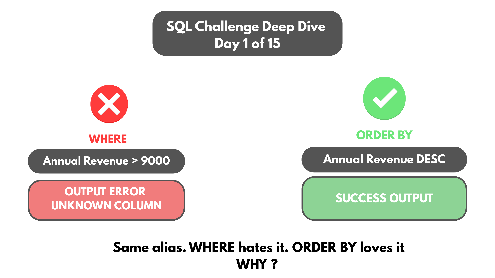
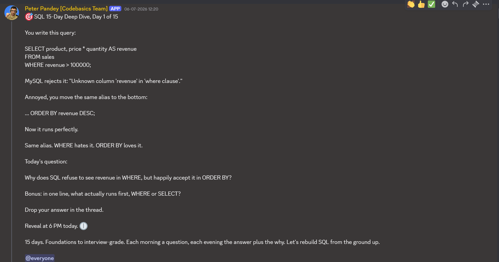

# Day 01 -- SQL's Logical Execution Order: Why WHERE Can't See an Alias ORDER BY Can



## Challenge



Why does this query fail?

```sql
SELECT product_code, gross_price * 12 AS annual_revenue
FROM fact_gross_price
WHERE annual_revenue > 9000;
```

```
Error Code: 1054. Unknown column 'annual_revenue' in 'where clause'
```

But the exact same alias works fine here:

```sql
SELECT product_code, gross_price * 12 AS annual_revenue
FROM fact_gross_price
ORDER BY annual_revenue DESC;
```

Same alias, same underlying query, just moved from WHERE to ORDER BY.
Why does one fail and the other work?

## Concept Covered

-- This isn't a MySQL bug. SQL does not execute in the order it's
written on the page -- it runs in a fixed logical order:

`FROM > WHERE > GROUP BY > HAVING > SELECT > ORDER BY`

-- `annual_revenue` is an alias, and aliases are created by SELECT.
WHERE runs before SELECT in this logical order, so at the point WHERE
executes, that alias simply doesn't exist yet -- there's nothing to
compare `> 9000` against.

-- ORDER BY runs after SELECT, once the alias has already been created,
so it can reference `annual_revenue` without any issue.

-- The written order (top to bottom on the page) and the logical
execution order are two different things, and this is exactly the kind
of mismatch that produces an error some places and not others, for what
looks like the same alias used the same way.

## Example Walkthrough

Working through both versions directly in MySQL Workbench, against the
`fact_gross_price` table (product_code, fiscal_year, gross_price):

**WHERE version -- fails:**

```sql
SELECT product_code, gross_price * 12 AS annual_revenue
FROM fact_gross_price
WHERE annual_revenue > 9000;
```

Returns `Error Code: 1054. Unknown column 'annual_revenue' in 'where clause'`.

**ORDER BY version -- works:**

```sql
SELECT product_code, gross_price * 12 AS annual_revenue
FROM fact_gross_price
ORDER BY annual_revenue DESC;
```

Runs cleanly and returns every product, sorted by annual revenue
descending -- note this version has no WHERE filter at all, so it isn't
limited to products above 9000, it's simply the full result set in
descending order.

## Results

Top of the full result set (1,182 rows total), sorted by annual_revenue
descending, with no WHERE filter applied:

| product_code | annual_revenue |
|-----------------|-----------------|
| A6120110205      | 10681.6368      |
| A6120110206      | 10533.0708      |
| A6119110201      | 10505.6232      |
| A6121110208      | 10445.7444      |
| A5921110208      | 10316.7984      |
| A5921110205      | 10273.3920      |
| A6019110107      | 10225.5252      |
| A5921110207      | 10213.8636      |
| A6018110103      | 10202.5788      |
| A6018110104      | 10181.6016      |

Full output, all 1,182 rows: [DAY-01-results.csv](DAY-01-results.csv)

The same `product_code` appears multiple times throughout this list (for
example, `A6120110205` shows up again further down at 10019.7744) --
that's expected, since `fact_gross_price` holds one row per product per
fiscal year, not one row per product overall. Sorting by annual_revenue
descending simply lines up every product-year combination from highest
to lowest, with no deduplication happening at any point in either query.

## A Note on This Day

This day's queries were rebuilt from a video walkthrough rather than a
saved SQL file, since the original query file wasn't kept during the
live challenge. The full results shown above, however, are a real
exported CSV, not a reconstruction. The dataset itself is AtliQ
Hardware's `fact_gross_price` table, reused from an earlier personal
project -- the query was written quickly at the time specifically to
demonstrate this concept clearly, not preserved as the exact original
challenge submission.

## Key Takeaway

SQL's written order and its logical execution order are not the same
thing, and this is the single concept that several later days in this
series build directly on -- WHERE running before SELECT creates an alias
is the same root cause behind why WHERE can't reference `Total_sales` in
Day 05, and part of why WHERE can silently defeat a LEFT JOIN in Day 06.
Knowing the real execution order, FROM, WHERE, GROUP BY, HAVING, SELECT,
ORDER BY, isn't trivia. It's the thing that explains why a query with no
typo and no obvious mistake still throws an error some of the time and
not others.

## Video Walkthrough

Watch on LinkedIn: [link]

## Files in This Folder

- DAY-01-Challenge.png -- challenge prompt
- DAY-01-Thumbnail.png -- video thumbnail
- [DAY-01-results.csv](DAY-01-results.csv) -- full ORDER BY output, all 1,182 rows
- *(No separate .sql query file for this day -- queries reconstructed from video screenshots, see note above)*
