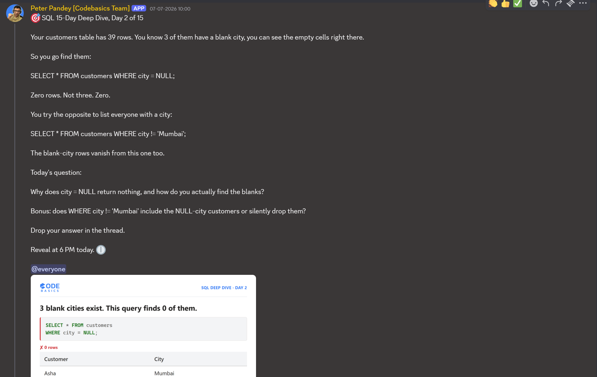

# Day 02 -- `= NULL` vs `IS NULL`



## Challenge

Today's prompt from Codebasics: a `customers` table with 39 rows, three of
them with a blank `city`.

```sql
SELECT * FROM customers WHERE city = NULL;
```

Returns 0 rows.

```sql
SELECT * FROM customers WHERE city != 'Mumbai';
```

The blank-city rows don't show up in this one either.

Question asked: why does `city = NULL` return nothing, and how do you
actually find the blanks? Bonus: does `city != 'Mumbai'` include the
NULL-city customers or drop them?

I connected this to a similar case on my own `movies` table:


```sql
SELECT * FROM movies;

SELECT COUNT(*) FROM movies;

SELECT * FROM movies WHERE imdb_rating = NULL;

SELECT COUNT(*) FROM movies WHERE imdb_rating = NULL;

SELECT COUNT(*) FROM movies WHERE imdb_rating != 10.0;
-- is not equal 10, but display 9,8,7,6,5,4,3,2,
```

The result grid for `SELECT * FROM movies` showed `movie_id 131` (Sanju)
with a blank `imdb_rating` cell:


## Fix

```sql
SELECT COUNT(*) FROM movies WHERE imdb_rating IS NULL;

SELECT * FROM movies WHERE imdb_rating IS NULL;
```


The result grid for `SELECT * FROM movies WHERE imdb_rating IS NULL`
showed the Sanju row:


| movie_id | title | industry | release_year | imdb_rating | studio | language_id |
|----------|-------|----------|---------------|-------------|--------|-------------|
| 131 | Sanju | Bollywood | 2018 | NULL | Vinod Chopra Films | 1 |

## Video Walkthrough

Watch on LinkedIn: [link]

## Files in This Folder

- [DAY-02-Queries.sql](DAY-02-Queries.sql) -- query file
- DAY-02-Challenge.png -- Codebasics Day 2 prompt (customers table)
- DAY-02-Query-Attempts.png -- queries run on the movies table
- DAY-02-Sanju-NULL-Visible.png -- Sanju's blank rating in the result grid
- DAY-02-IS-NULL-Query.png -- the IS NULL query
- DAY-02-IS-NULL-Result.png -- Sanju surfaced by IS NULL
