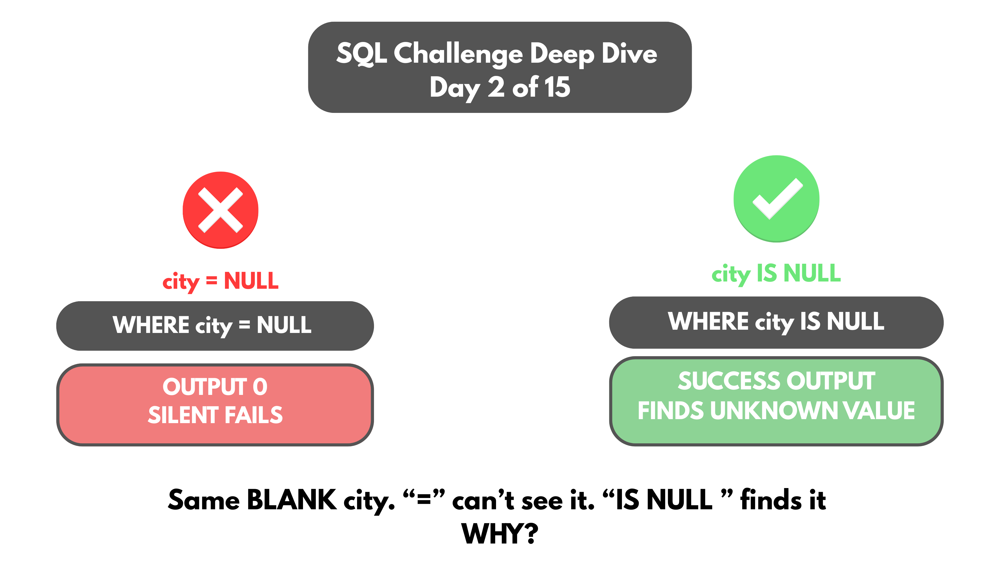

# Day 02 -- `= NULL` vs `IS NULL`



## Challenge


Today's prompt from Codebasics: a `customers` table with 39 rows, three of
them with a blank `city`.

```sql
SELECT * FROM customers WHERE city = NULL;
```

Returns 0 rows.

Second attempt:

```sql
SELECT * FROM customers WHERE city != 'Mumbai';
```

The blank-city customers don't appear here either.

The challenge: why does `city = NULL` return nothing, how do you actually
find the blank values, and why does `city != 'Mumbai'` also exclude the
NULL-city customers?

I connected this to a similar case in my own `movies` table.

```sql
SELECT * FROM movies;

SELECT COUNT(*) FROM movies;

SELECT * FROM movies WHERE imdb_rating = NULL;

SELECT COUNT(*) FROM movies WHERE imdb_rating = NULL;

SELECT COUNT(*) FROM movies WHERE imdb_rating != 10.0;
```

The result grid showed `movie_id 131` -- Sanju -- with a blank
`imdb_rating`.

The data was there. The problem was the way I was comparing against NULL.

## Concept Covered

`NULL` is not a normal value. It represents missing or unknown data.

That means SQL cannot treat:

```sql
imdb_rating = NULL
```

like a normal comparison.

The result is `UNKNOWN`, not `TRUE`.

Since `WHERE` only keeps rows where the condition evaluates to TRUE,
the row is filtered out.

The same thing happens with:

```sql
SELECT * FROM movies
WHERE imdb_rating != 10.0;
```

A NULL rating is not automatically considered "not equal to 10.0".
SQL doesn't know what the missing value actually is, so the comparison
again evaluates to UNKNOWN.

That's SQL's three-valued logic:

```text
TRUE
FALSE
UNKNOWN
```

For NULL, SQL provides dedicated operators:

```sql
IS NULL
IS NOT NULL
```

## Example Walkthrough

```sql
SELECT COUNT(*)
FROM movies
WHERE imdb_rating IS NULL;

SELECT *
FROM movies
WHERE imdb_rating IS NULL;
```

This correctly surfaces Sanju:

| movie_id | title | industry | release_year | imdb_rating | studio | language_id |
| -------- | ----- | -------- | ------------ | ----------- | ------ | ----------- |
| 131 | Sanju | Bollywood | 2018 | NULL | Vinod Chopra Films | 1 |

The difference is simple:

```text
= NULL      → UNKNOWN
IS NULL     → TRUE when the value is NULL
```

Full query file: [DAY-02-Queries.sql](DAY-02-Queries.sql)

## Results

Running the corrected query against the `movies` table surfaces the one
row with a missing IMDb rating:

| movie_id | title | industry | release_year | imdb_rating | studio | language_id |
| -------- | ----- | -------- | ------------ | ----------- | ------ | ----------- |
| 131 | Sanju | Bollywood | 2018 | NULL | Vinod Chopra Films | 1 |

The incorrect query:

```sql
SELECT * FROM movies
WHERE imdb_rating = NULL;
```

returned **0 rows**.

The corrected query:

```sql
SELECT * FROM movies
WHERE imdb_rating IS NULL;
```

returned **Sanju (`movie_id = 131`)**.

Full output: [DAY-02-results.csv](DAY-02-results.csv)

This also answers the original Codebasics challenge:

```sql
SELECT * FROM customers
WHERE city IS NULL;
```

is the correct way to find customers whose city is missing.

And:

```sql
SELECT * FROM customers
WHERE city != 'Mumbai';
```

does not include NULL-city customers because SQL cannot confirm that an
unknown value is different from Mumbai.

## Applying the Concept

The same issue appears whenever NULL is involved in a comparison.

For example:

```sql
SELECT *
FROM movies
WHERE imdb_rating != 10.0;
```

This returns movies whose rating is known and is not 10.0.

But if the requirement is to include movies with no rating as well:

```sql
SELECT *
FROM movies
WHERE imdb_rating != 10.0
   OR imdb_rating IS NULL;
```

Now both conditions are handled explicitly.

This is the important distinction:

```text
= NULL        → UNKNOWN
!= NULL       → UNKNOWN
IS NULL       → TRUE for NULL values
IS NOT NULL   → TRUE for non-NULL values
```

## Key Takeaway

`NULL` is not a normal value that can be compared using `=` or `!=`.

`= NULL` does not mean "is missing." It produces UNKNOWN.

`!= 'Mumbai'` also does not mean "everything except Mumbai" because
NULL values cannot be confirmed to be different from Mumbai.

Use `IS NULL` to find missing values and `IS NOT NULL` to find values
that exist.

The bigger lesson is SQL's three-valued logic: a condition can be TRUE,
FALSE, or UNKNOWN. `WHERE` keeps only TRUE rows, which is why NULL values
can disappear from results even though the row itself exists.

## Video Walkthrough

Watch on LinkedIn: [link]

## Files in This Folder

- [DAY-02-Queries.sql](DAY-02-Queries.sql) -- query file
- [DAY-02-results.csv](DAY-02-results.csv) -- full query output
- [DAY-02-Challenge.png](DAY-02-Challenge.png) -- Codebasics Day 2 prompt
- [DAY-02-Query-Attempts.png](DAY-02-Query-Attempts.png) -- queries run on the movies table
- [DAY-02-Sanju-NULL-Visible.png](DAY-02-Sanju-NULL-Visible.png) -- Sanju's blank imdb_rating in the result grid
- [DAY-02-IS-NULL-Query.png](DAY-02-IS-NULL-Query.png) -- IS NULL query
- [DAY-02-IS-NULL-Result.png](DAY-02-IS-NULL-Result.png) -- Sanju surfaced by IS NULL
- [DAY-02-Thumbnail.png](DAY-02-Thumbnail.png) -- video thumbnail
