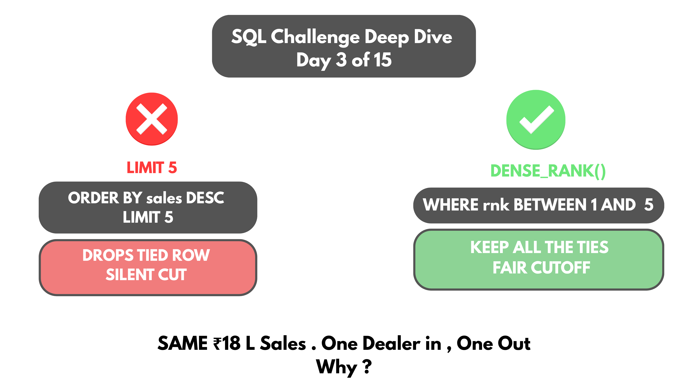
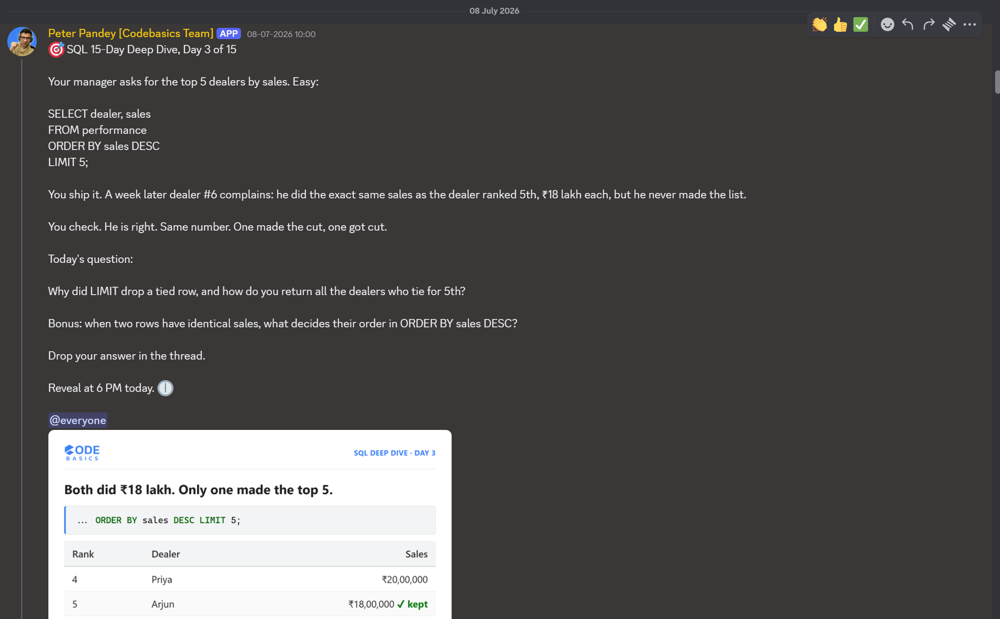

# Day 03 -- Top-N Records with Ties (LIMIT vs Window Functions)



## Challenge



A dealer performance table. Manager wants the top 5 dealers by sales.

SELECT dealer, sales FROM performance ORDER BY sales DESC LIMIT 5;

Ships fine, until dealer #6 complains a week later. Dealer #5 and dealer #6 
both posted ₹18 lakh in sales. One made the list. One didn't.

## Concept Covered
-- ORDER BY sorts the column's values. LIMIT sorts by position, not value 
-- it counts 1, 2, 3, 4, 5 and stops. It has no idea row 6 is tied with row 5.

-- LIMIT counts rows, not ranks. Two dealers can post identical sales and 
still get split, one in, one out, because LIMIT was only ever asked for 
5 rows, not "who's tied for 5th."

-- The fix is a window function. Three options exist -- ROW_NUMBER, RANK, 
DENSE_RANK -- and each handles ties differently. DENSE_RANK was used here 
because it gives tied rows the same rank instead of skipping or splitting 
them apart.

-- Bonus note: when two rows tie, ORDER BY doesn't guarantee which one 
lands first. Without a tiebreaker column, the order depends on how the 
data physically sits or how the engine sorts internally -- not something 
to rely on.

## Example Walkthrough
Demonstrated using a student_marks table, ranking students by marks:

```sql
WITH CTE1 AS (
  SELECT name, marks,
         DENSE_RANK() OVER (ORDER BY marks DESC) AS rnk
  FROM student_marks
)
SELECT *
FROM CTE1
WHERE rnk BETWEEN 1 AND 5;
```

## Results

| Rank | Student  | Marks |
|------|----------|-------|
| 1    | Ishika   | 98    |
| 2    | Ravi     | 95    |
| 3    | Raju     | 90    |
| 4    | Ramesh   | 85    |
| 5    | Prashant | 72    |

Query returned 14 total rows in the base table, filtered down to the top 5 
by DENSE_RANK. Every student tied for 5th place makes the cut here, not 
just whichever one SQL happened to sort first.

## Applying the Concept
Same problem, same approach, applied back to the original dealer scenario:

```sql
WITH CTE1 AS (
  SELECT dealer, sales,
         DENSE_RANK() OVER (ORDER BY sales DESC) AS sales_rnk
  FROM performance
)
SELECT *
FROM CTE1
WHERE sales_rnk BETWEEN 1 AND 5;
```

## Key Takeaway
This wasn't really about ranking syntax. Think about what "top 5" actually 
decides -- a discount, a scholarship, a gift. LIMIT 5 doesn't just cut off 
rows. It can remove a reward someone genuinely earned.

## Video Walkthrough
Watch on LinkedIn: [link]
