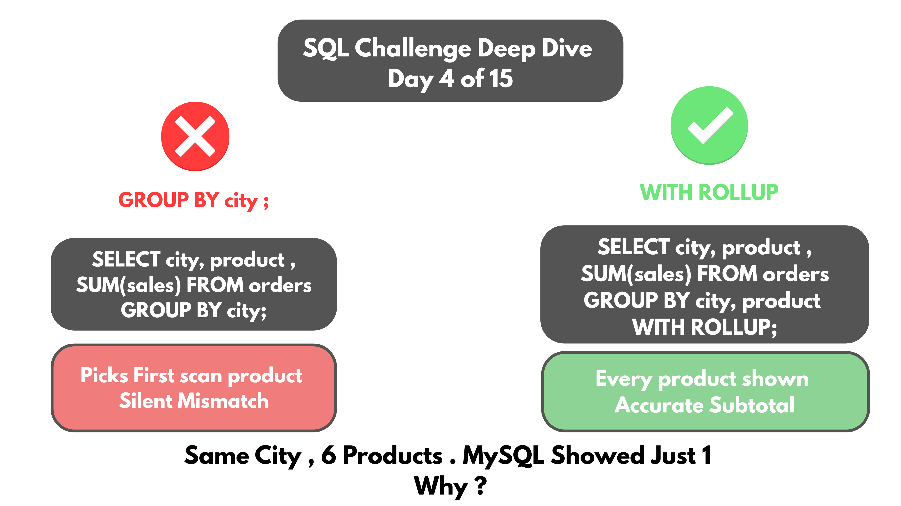
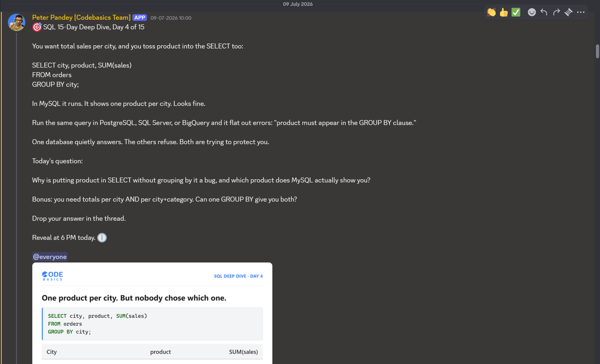

# Day 04 -- GROUP BY, Silent Aggregation Bugs, and Why MySQL Doesn't Warn You



## Challenge



```sql
SELECT city, product, SUM(sales) FROM orders GROUP BY city;
```

MySQL runs this without complaint and shows one product per city. Looks
fine. Postgres, SQL Server, and BigQuery all refuse it outright -- product
must appear in the GROUP BY clause.

A dataset was built to test this properly: five cities, three categories,
two distinct products per category, every product ordered twice. Running
the query above, Chennai showed "Laptop, 107830." But Chennai actually
sells six different products, not one.

## Concept Covered

-- SUM(sales) is always correct. It genuinely adds every row in the group.

-- product isn't aggregated and isn't grouped. SQL has no rule for picking
one product to represent six.

-- It isn't picking the top seller either. Hyderabad showed "Mouse" with
3900, while Headphones in the same city sold for 9800 -- a bigger number
that never appeared.

-- MySQL just grabs whichever row it scans first and labels the total
with it. No error, no warning -- just a quietly wrong label sitting next
to a correct sum.

## Example Walkthrough

The fix: group by every non-aggregated column that's actually selected.

```sql
SELECT city, product, SUM(sales) AS Total_sales
FROM orders
WHERE city = "Chennai"
GROUP BY city, product WITH ROLLUP;
```

Full query file: [DAY-04-Queries.sql](DAY-04-Queries.sql)

## Results

**Broken query** (`GROUP BY city` only) -- Chennai collapses to a single,
misleading row:

| City    | Product | Total_sales |
|---------|---------|-------------|
| Chennai | Laptop  | 107830      |

**Fixed query** (`GROUP BY city, product WITH ROLLUP`) -- every product
gets its own honest row, grouped by category, with one subtotal line:

| Category    | Product   | Total_sales |
|-------------|-----------|-------------|
| Electronics | Laptop    | 98000       |
| Electronics | Mouse     | 1050        |
| Groceries   | Rice Bag  | 1650        |
| Groceries   | Biscuits  | 330         |
| Clothing    | T-Shirt   | 2500        |
| Clothing    | Jeans     | 4300        |
| --          | **Total** | **107830**  |

Same total sales figure either way -- SUM(sales) was never wrong. What was
wrong was the product label sitting next to it, silently misrepresenting
six rows as one.

## Applying the Concept

Bonus question: totals are needed per city AND per city+category. Can one
GROUP BY give both?

```sql
SELECT city, category, SUM(sales) AS Total_sales
FROM orders
GROUP BY city, category WITH ROLLUP;
```

One GROUP BY gives an answer, but it doesn't fully match the requirement.
The textbook fix is GROUPING SETS, which produces both aggregation levels
in a single result set -- but that feature only exists from MySQL 8.0.31
onward, and this challenge ran on MySQL 8.0.28. So the actual fix used was
WITH ROLLUP instead: same two levels of totals, plus one extra grand total
row added on top.

## Key Takeaway

This wasn't really about syntax. It's that a query running without an
error doesn't mean it answered the question correctly. MySQL didn't
protect against this mistake -- it just stayed quiet while returning a
technically-valid, practically-wrong result.

## Video Walkthrough

Watch on LinkedIn: [link]

## Files in This Folder

- [DAY-04-Queries.sql](DAY-04-Queries.sql) -- full query file
- DAY-04-Challenge.png -- challenge prompt
- DAY-04-Thumbnail.png -- video thumbnail
