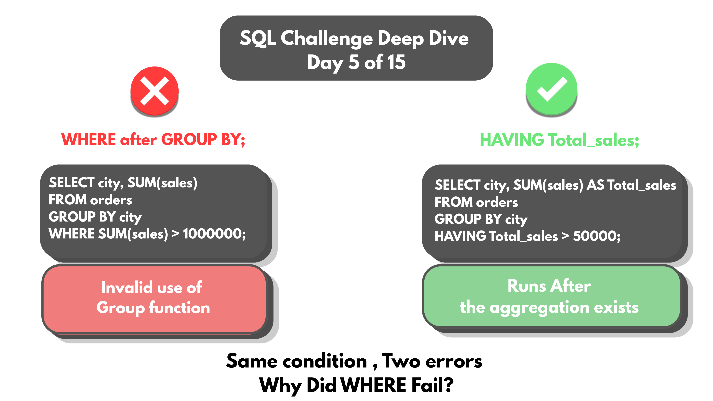
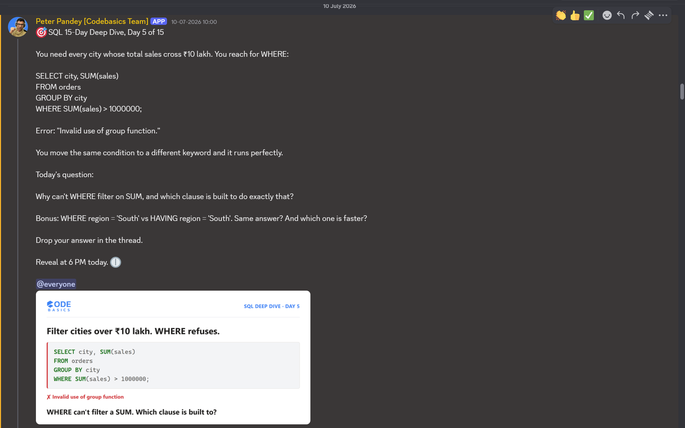

# Day 05 -- WHERE vs HAVING: Written Order vs Logical Order



## Challenge



Every city crossing ₹10 lakh in sales is needed. WHERE feels like the
obvious move.

```sql
SELECT city, SUM(sales)
FROM orders
GROUP BY city
WHERE SUM(sales) > 1000000;
```

MySQL disagrees: `Invalid use of group function.`

Second attempt -- move WHERE right after FROM, matching the syntax order
SQL is written in (SELECT > FROM > WHERE > GROUP BY > HAVING):

```sql
SELECT city, SUM(sales) AS Total_sales
FROM orders
WHERE Total_sales > 50000
GROUP BY city;
```

New error: `Unknown column 'Total_sales' in 'where clause'.`

Two errors. Same root cause.

## Concept Covered

-- Error one is a typing-order problem. SQL expects clauses written in a
fixed sequence: SELECT, FROM, WHERE, GROUP BY, HAVING. Placing WHERE after
GROUP BY breaks that sequence before logic is even checked.

-- Error two is a different rule entirely. `Total_sales` is an alias that
SELECT creates. But SQL's actual execution order is not the same as its
written order -- it runs FROM > WHERE > GROUP BY > AGGREGATION > HAVING >
SELECT > ORDER BY. WHERE executes before SELECT ever builds the alias, so
it literally cannot see a name that doesn't exist yet at that point.

-- HAVING sits later in the real execution order -- after grouping, after
the aggregate is computed, after SELECT has built the alias. That's why
HAVING can reference `Total_sales` and WHERE can't.

## Example Walkthrough

```sql
SELECT city, SUM(sales) AS Total_sales
FROM orders
GROUP BY city
HAVING Total_sales > 50000;
```

Runs clean. HAVING comes after grouping and aggregation in the logical
order, so it can see both the raw aggregate and the alias SELECT created.

Full query file: [DAY-05-Queries.sql](DAY-05-Queries.sql)

## Results

Running the fixed query against the 12-city dataset, filtering to cities
crossing 50,000 in total sales:

| City      | Total_sales |
|-----------|-------------|
| Chennai   | 107830      |
| Bangalore | 155800      |
| Mumbai    | 78800       |
| Pune      | 111150      |
| Ahmedabad | 68565       |
| Kolkata   | 205230      |
| Ranchi    | 109140      |
| Patna     | 66620       |
| Delhi     | 181550      |
| Lucknow   | 152380      |

Full output: [DAY-05-results.csv](DAY-05-results.csv)

10 of the 12 cities cleared the threshold. Hyderabad (23230) and Jaipur
(14190) didn't -- both correctly dropped by HAVING since neither total
exceeds 50000.

## Applying the Concept

Bonus question: `WHERE region = 'South'` vs `HAVING region = 'South'` --
same answer, but is the cost the same?

```sql
SELECT region, SUM(sales) AS Total_sales
FROM orders
WHERE region = 'South'
GROUP BY region;
```

WHERE filters first. Region is checked on every row before grouping ever
happens. Only Chennai, Bangalore, and Hyderabad pass -- 36 rows out of
144. Grouping and SUM only ever touch those 36 rows; the other 108 are
removed before any aggregation work starts.

```sql
SELECT region, SUM(sales) AS Total_sales
FROM orders
GROUP BY region
HAVING region = 'South';
```

HAVING filters last. All 144 rows get grouped into all four regions first
-- South, West, East, North, 36 rows each. SUM runs on all four groups,
not just one. Only after three full totals (West, East, North) have
already been calculated does HAVING check which group is South and throw
the other three away.

Same final answer either way -- both queries return the identical single
row:

| Region | Total_sales |
|--------|-------------|
| South  | 286860      |

(Chennai 107830 + Bangalore 155800 + Hyderabad 23230 = 286860, confirming
the three South cities from Day 04's dataset.)

But the two queries do a meaningfully different amount of work to get
there. WHERE removes 108 of 144 rows before any grouping or SUM happens
-- only the 36 South rows ever get aggregated. HAVING aggregates all 144
rows into four full regional totals first, then discards three of them.
Same output, but WHERE does strictly less work to produce it -- for a
filter like this, on a column that isn't itself an aggregate, WHERE is
the better choice.

This challenge was rebuilt on top of the Day 4 dataset, with a region
column added and expanded to 12 cities across South, West, East, and
North -- so this wasn't tested on a fresh table, it was layered on data
already in place.

## Key Takeaway

SQL's written order and its logical execution order are not the same
thing, and confusing the two produces two distinct kinds of errors --
one from breaking the required clause sequence, one from referencing an
alias before it exists. WHERE and HAVING can sometimes land on the same
answer, but they are not interchangeable: WHERE filters rows before
grouping happens, HAVING filters groups after aggregation is already
done. Reaching for HAVING out of habit, even when WHERE would work, means
paying for aggregation work that didn't need to happen.

## Video Walkthrough

Watch on LinkedIn: [link]

## Files in This Folder

- [DAY-05-Queries.sql](DAY-05-Queries.sql) -- full query file
- [DAY-05-results.csv](DAY-05-results.csv) -- cities crossing 50,000 in sales
- [DAY-05-Bonus-results.csv](DAY-05-Bonus-results.csv) -- South region total (WHERE vs HAVING)
- DAY-05-Challenge.png -- challenge prompt
- DAY-05-Thumbnail.png -- video thumbnail
