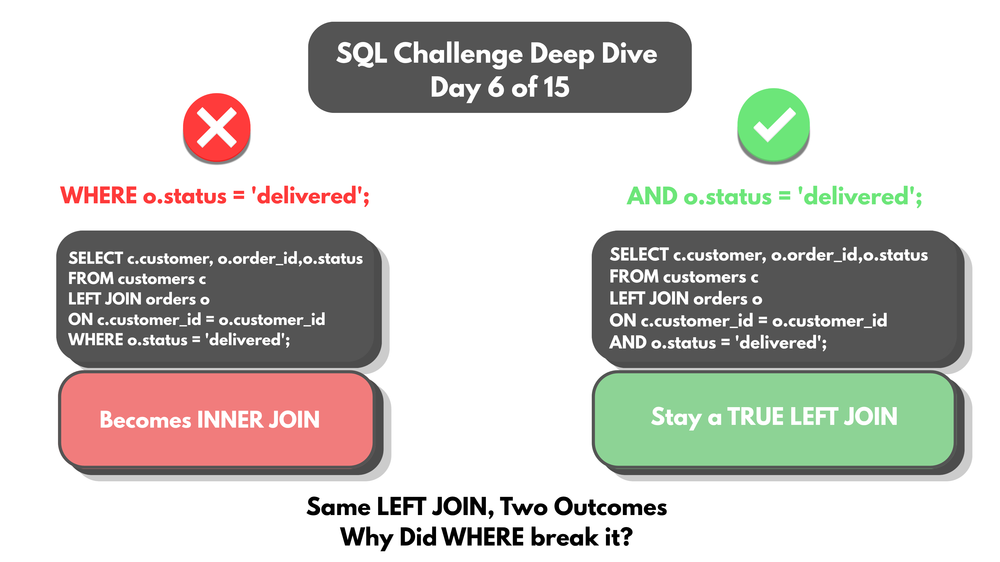
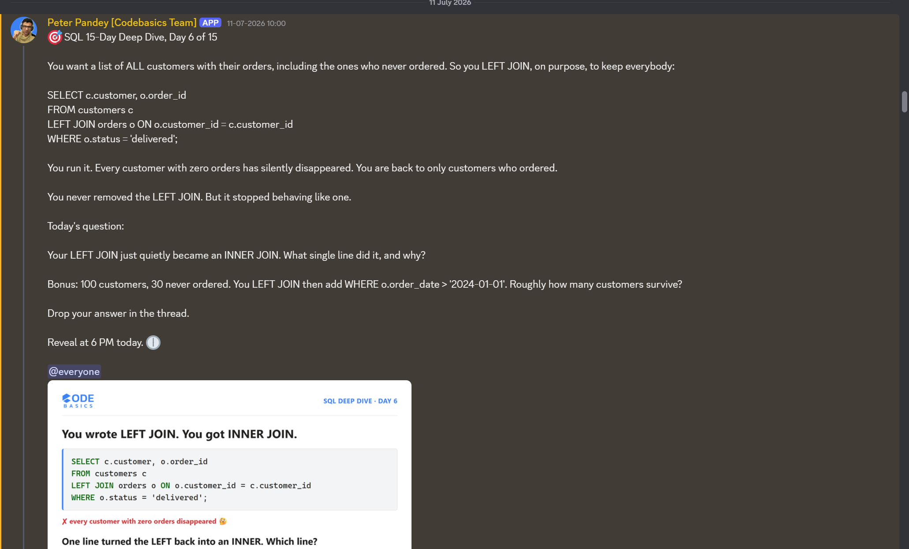

# Day 06 -- How WHERE Silently Turns a LEFT JOIN into an INNER JOIN



## Challenge



Every customer is needed, including the ones who never ordered anything.
LEFT JOIN is built exactly for this -- keep everybody, matched or not.

```sql
SELECT c.customer, o.order_id, o.status
FROM customers c
LEFT JOIN orders o ON c.customer_id = o.customer_id
WHERE o.status = 'delivered';
```

Run it, and every customer with zero orders is silently gone. No error.
No warning. LEFT JOIN itself was never touched -- it just stopped
behaving like one.

## Concept Covered

-- NULL isn't "no." It's SQL saying *I don't know*. WHERE only asks
yes/no questions -- it can't act on a question it can't actually answer.

-- Walking through what WHERE o.status = 'delivered' actually does to
each customer:

| Customer        | order status | 'status' = 'delivered' ? | Result |
|------------------|--------------|---------------------------|--------|
| Divya Rao        | delivered    | YES                       | keep   |
| Karthik Reddy     | pending      | NO                        | drop   |
| Meera Shah        | cancelled    | NO                        | drop   |
| Rohan Deshmukh    | delivered    | YES                       | keep   |
| Sneha Iyer        | NULL         | unknown                   | drop   |

-- A customer with a pending or cancelled order gets a real FALSE --
genuinely a no, a fair drop. A customer with no order at all gets
UNKNOWN -- they never got a fair test to begin with. Same missing row on
screen, completely different reason underneath.

-- That one line, `WHERE o.status = 'delivered'`, is what turns a
LEFT JOIN into an INNER JOIN. The join itself still runs correctly and
produces NULL placeholder rows for unmatched customers -- WHERE is what
throws those rows away afterward, because it can't tell the difference
between "no" and "no answer."

## Example Walkthrough

Fix: move the condition into the join itself, using AND inside ON,
instead of filtering with WHERE afterward.

```sql
SELECT c.customer, o.order_id, o.status
FROM customers c
LEFT JOIN orders o
  ON c.customer_id = o.customer_id
  AND o.status = 'delivered';
```

Inside ON, AND is evaluated as part of building the match itself, before
LEFT JOIN decides which rows get a NULL placeholder:

| Customer        | status check          | Result |
|------------------|------------------------|--------|
| Divya Rao        | TRUE AND TRUE          | TRUE   |
| Karthik Reddy     | TRUE AND (pending=FALSE)| FALSE  |
| Sneha Iyer        | TRUE AND (NULL=unknown)| DROP (unmatched, but kept as a customer row) |

Every customer appears in the result now -- the ones who ordered and the
ones who never did -- because LEFT JOIN's core guarantee (keep every row
from the left table) was never interfered with.

Full query file: [DAY-06-Queries.sql](DAY-06-Queries.sql)

## Results

Running the fixed query -- `AND o.status = 'delivered'` inside ON -- against
the full 20-customer table:

| Outcome                                    | Count |
|---------------------------------------------|-------|
| Customers with delivered orders (real rows) | 12    |
| Delivered order rows returned               | 78    |
| Customers with zero orders (NULL rows kept) | 8     |
| Total customers represented                 | 20    |

All 20 customers show up in the output -- the 12 who ordered, each with
every one of their delivered orders listed, and the 8 who never ordered
at all, each kept as a single row with `order_id` and `status` as NULL
instead of being silently dropped.

Full output: [DAY-06-results.csv](DAY-06-results.csv)

That's the fix proven directly: LEFT JOIN's core guarantee -- every row
from the left table survives -- holds exactly as it should once the
status condition moved into ON instead of WHERE.

## Applying the Concept

Bonus question: with 100 customers, 30 of whom never ordered, a LEFT JOIN
is filtered afterward with `WHERE o.order_date > '2024-01-01'`. Roughly
how many customers survive?

```sql
SELECT c.customer, o.order_id, o.status
FROM customers c
LEFT JOIN orders o ON c.customer_id = o.customer_id
WHERE o.order_date > '2024-01-01';
```

This challenge was rebuilt on the Day 05 database -- `customer_id`,
`status`, and `order_date` added to orders, plus a new `customers` table
(`customer_id`, `customer`, `city`, `region`). 20 customers total, 12
with real orders, 8 with none -- so the NULLs here are real, not
simulated.

The unfiltered LEFT JOIN produces 152 rows: 144 real order rows, plus 8
NULL placeholder rows, one per customer who never ordered. Filtering on
`order_date` guarantees all 8 NULL rows drop -- NULL can never satisfy a
`>` comparison, so those 8 customers vanish regardless of what the actual
cutoff date is.

That leaves the 144 real order rows to be tested individually against the
date condition. The confirmed output:

Full output: [DAY-06-Bonus-results.csv](DAY-06-Bonus-results.csv)

**122 rows survived.** Of the 144 real orders, 22 had an `order_date` on
or before 2024-01-01 and were correctly filtered out -- and all 8
never-ordered customers were dropped as expected, for the NULL reason
above rather than a genuine failed comparison.

One customer disappears from the results entirely: Arjun Kumar. All of
his orders had dates on or before the cutoff, so despite having 6
delivered orders in the unfiltered results, none of them satisfy
`order_date > '2024-01-01'` -- his customer row doesn't survive the
filter at all, even though he's a real customer with real order history.
That's the same WHERE-after-JOIN mechanic from earlier in this challenge,
just triggered by a date condition instead of a status condition.

## Key Takeaway

A LEFT JOIN's guarantee only survives as long as nothing filters its
output afterward with a plain WHERE on the right-hand table. WHERE cannot
distinguish a genuine FALSE from an UNKNOWN caused by NULL -- both get
dropped identically, with no error to flag that anything happened. Moving
a condition into the join's ON clause keeps the LEFT JOIN's promise
intact: every row from the left table stays, matched or not.

## Video Walkthrough

Watch on LinkedIn: [link]

## Files in This Folder

- [DAY-06-Queries.sql](DAY-06-Queries.sql) -- full query file
- [DAY-06-results.csv](DAY-06-results.csv) -- fixed query output, all 20 customers
- [DAY-06-Bonus-results.csv](DAY-06-Bonus-results.csv) -- date-filtered results, 122 surviving rows
- DAY-06-Challenge.png -- challenge prompt
- DAY-06-Thumbnail.png -- video thumbnail
