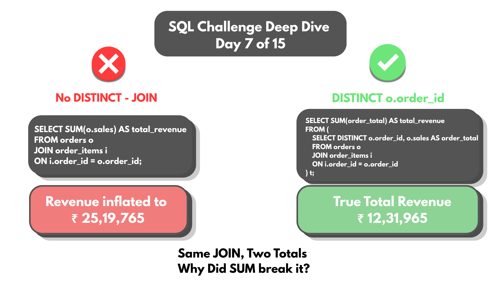
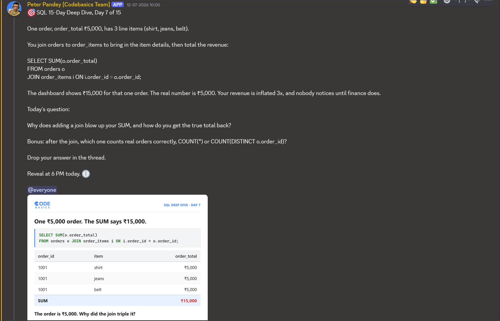

# Day 07 -- How a JOIN Fan-Out Silently Inflates a SUM



## Challenge



Why can adding a single JOIN to a SUM throw the total off by nearly 2x?

```sql
SELECT SUM(o.sales) AS total_revenue
FROM orders o
JOIN order_items i
  ON i.order_id = o.order_id;
```

This runs without error and returns a number -- just the wrong one.

## Concept Covered

-- `orders JOIN order_items` matches every item row to its order and
copies `o.sales` onto each matched row -- not split across items, just
repeated in full on every one of them.

-- Order #1 has 2 items (a laptop and an extended warranty), so its
₹50,000 sale value appears twice in the joined result before SUM ever
runs.

-- SUM simply adds up whatever rows are in front of it. It has no concept
of "this ₹50,000 belongs to the order, not to each item under it" -- that
distinction has to be enforced before aggregation, not during it.

-- Across 144 orders with varying item counts, this duplication pushes
the total from the true ₹12,31,965 up to ₹25,19,765 -- more than double,
simply because some orders have 1 item and others have 2 or more, each
one re-copying the full order total.

What SQL actually sees after the join, using order #1 as an example:

| order_id | sales (from orders) | item_name          |
|----------|----------------------|---------------------|
| 1        | 50000                | Laptop              |
| 1        | 50000                | Extended Warranty   |

Two rows, each carrying the full 50000 -- so SUM(o.sales) counts 100000
for an order that actually totals 50000.

## Example Walkthrough

True total, calculated directly from the orders table with no join at
all -- the number the joined query should have matched:

```sql
SELECT SUM(sales) AS true_total
FROM orders;
```

The fix: wrap the join in a subquery, keep only `order_id` and `sales`,
and drop `item_name` entirely. Once `item_name` is gone, the duplicate
rows for the same order become byte-for-byte identical -- which means
`SELECT DISTINCT` can collapse them back down to exactly one row per
order.

```sql
SELECT SUM(order_total) AS total_revenue
FROM (
  SELECT DISTINCT o.order_id, o.sales AS order_total
  FROM orders o
  JOIN order_items i
    ON i.order_id = o.order_id
) t;
```

Same order #1 example, after DISTINCT collapses the duplicate:

| order_id | order_total |
|----------|-------------|
| 1        | 50000       |

144 rows instead of 288. Summing that clean result gives ₹12,31,965 --
matching the true total exactly.

Full query file: [DAY-07-Queries.sql](DAY-07-Queries.sql)

## Results

Running the fixed subquery against the full 144-order dataset:

| total_revenue |
|----------------|
| 1231965        |

Full output: [DAY-07-results.csv](DAY-07-results.csv)

This matches the true total from `SELECT SUM(sales) FROM orders` exactly
-- confirming the DISTINCT-wrapped subquery fully undoes the fan-out
caused by the join, with no revenue lost or double-counted.

## Applying the Concept

Bonus question: after the join, which one actually counts real orders --
`COUNT(*)` or `COUNT(DISTINCT o.order_id)`?

```sql
SELECT
    COUNT(*) AS row_count_wrong,
    COUNT(DISTINCT o.order_id) AS real_order_count
FROM orders o
JOIN order_items i ON i.order_id = o.order_id;
```

-- `COUNT(*)` returns 288 -- it counts item rows, not orders. Every order
with 2 items contributes 2 to this count, same fan-out problem as SUM.

-- `COUNT(DISTINCT o.order_id)` returns 144 -- the actual number of
orders, because it only counts unique `order_id` values regardless of how
many item rows each one produced.

Confirmed output, both counts run side by side against the same joined
data:

| row_count_wrong | real_order_count |
|-------------------|---------------------|
| 288                | 144                  |

Full output: [DAY-07-Bonus-results.csv](DAY-07-Bonus-results.csv)

`COUNT(DISTINCT o.order_id)` is the right choice here. It counts unique
orders, not the extra rows the join creates -- the same underlying fix as
the SUM problem, just applied to counting instead of totaling.

This challenge builds on the same database from Day 06, extended with a
new `order_items` table for Day 07's requirement.

## Key Takeaway

A JOIN doesn't know or care whether the relationship on the other side is
one-to-one or one-to-many. When it's one-to-many -- one order, multiple
items -- every "one" side value gets copied onto every matching row, and
any aggregate run afterward (SUM, COUNT(*), AVG) inherits that
duplication silently. The fix isn't a special SQL trick -- it's
recognizing the fan-out before aggregating, and either isolating distinct
rows first or choosing an aggregate (like COUNT(DISTINCT)) that's
duplicate-aware by design.

## Video Walkthrough

Watch on LinkedIn: [Video-presentation](https://www.linkedin.com/posts/vishnu-ram-sachin-d-_sql-dataanalytics-codebasics-activity-7482025988520947712-yiOa?utm_source=share&utm_medium=member_desktop&rcm=ACoAAD-YjK4B1ekkuKaP0cSvVwYi6kAAiCTAQhY)

## Files in This Folder

- [DAY-07-Queries.sql](DAY-07-Queries.sql) -- full query file
- [DAY-07-results.csv](DAY-07-results.csv) -- fixed total_revenue output
- [DAY-07-Bonus-results.csv](DAY-07-Bonus-results.csv) -- COUNT(*) vs COUNT(DISTINCT) comparison
- DAY-07-Challenge.png -- challenge prompt
- DAY-07-Thumbnail.png -- video thumbnail
