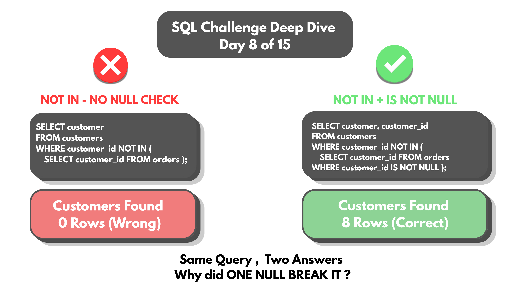
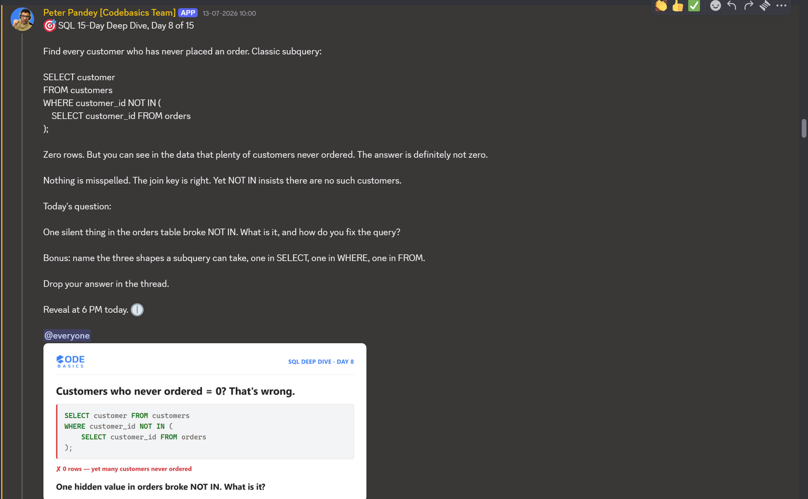

# Day 08 -- NULL and NOT IN: The Silent Zero-Row Bug



## Challenge



A query ran clean. No errors. Returned 0 rows.

But scrolling through the data, customers who never placed an order were
sitting right there -- real names, clearly present in the table. Nothing
was misspelled, the logic looked right, and something invisible inside
one table broke the whole thing anyway.

```sql
SELECT customer
FROM customers
WHERE customer_id NOT IN (
    SELECT customer_id FROM orders
);
```

Returns 0 rows -- even though 8 customers genuinely never ordered.

## Concept Covered

-- NULL means *unknown value*, not zero and not blank.

-- `NOT IN` internally expands into a chain of `<>` comparisons joined by
AND -- every value in the subquery's result list has to fail the match
for a row to be kept.

-- One NULL slipped into the `orders` table (a row with no `customer_id`
assigned). That single NULL breaks every comparison in the chain, because
comparing anything to NULL doesn't resolve to TRUE or FALSE -- it
resolves to UNKNOWN.

Walking through a simplified version of the chain, with orders containing
customer_ids 11, 12, and one NULL:

| Comparison         | Result    |
|----------------------|-----------|
| 13 <> 11              | TRUE      |
| 13 <> 12              | TRUE      |
| 13 <> NULL            | UNKNOWN   |

AND requires every condition to be TRUE. TRUE AND TRUE AND UNKNOWN
doesn't evaluate to TRUE -- it evaluates to UNKNOWN, and WHERE only keeps
rows that resolve to TRUE. So the entire row gets dropped, for every
single customer, regardless of whether their own `customer_id` was
actually present in `orders` or not. One NULL anywhere in the subquery's
result list is enough to poison the whole `NOT IN` check.

-- Even `NULL = NULL` evaluates to UNKNOWN, not TRUE -- NULL never
matches anything, including itself.

## Example Walkthrough

The fix: exclude the NULL from the subquery's result list before `NOT IN`
ever builds its comparison chain.

```sql
SELECT customer, customer_id
FROM customers
WHERE customer_id NOT IN (
    SELECT customer_id FROM orders WHERE customer_id IS NOT NULL
);
```

`IS NOT NULL` clears the NULL out at the source. With no NULL left in the
list, every comparison in the chain resolves cleanly to TRUE or FALSE --
nothing left to silently break it.

Full query file: [DAY-08-Queries.sql](DAY-08-Queries.sql)

## Results

Running the fixed query against the full customer table:

| customer         | customer_id |
|--------------------|-------------|
| Sneha Iyer          | 13          |
| Farhan Ali          | 14          |
| Pooja Nair          | 15          |
| Kabir Joshi         | 16          |
| Ritu Sen            | 17          |
| Manoj Tiwari        | 18          |
| Ishaan Chawla       | 19          |
| Simran Kaur         | 20          |

Full output: [DAY-08-results.csv](DAY-08-results.csv)

All 8 customers who never placed an order -- the same 8 identified back
in Day 06's NULL-placeholder rows -- correctly appear here. Zero-row bug
fixed.

## Applying the Concept

Bonus: name the three shapes a subquery can take -- one in SELECT, one in
WHERE, one in FROM.

**Shape 1 -- inside SELECT.** Returns one lookup value per outer row,
computed independently for each customer:

```sql
SELECT c.customer,
  (SELECT COUNT(*) FROM orders o WHERE o.customer_id = c.customer_id) AS total_orders
FROM customers c;
```

Confirmed output -- every ordering customer shows their real order count,
every non-ordering customer shows 0 rather than being excluded entirely:

| customer         | total_orders |
|--------------------|--------------|
| Arjun Kumar         | 12           |
| Divya Rao           | 12           |
| Karthik Reddy       | 12           |
| Meera Shah          | 12           |
| Rohan Deshmukh      | 12           |
| Nisha Patel         | 12           |
| Sourav Ghosh        | 12           |
| Anjali Kumari       | 12           |
| Rajesh Singh        | 13           |
| Vikram Malhotra     | 12           |
| Priya Sharma        | 12           |
| Amit Verma          | 12           |
| Sneha Iyer          | 0            |
| Farhan Ali          | 0            |
| Pooja Nair          | 0            |
| Kabir Joshi         | 0            |
| Ritu Sen            | 0            |
| Manoj Tiwari        | 0            |
| Ishaan Chawla       | 0            |
| Simran Kaur         | 0            |

Full output: [DAY-08-Bonus-SELECT-results.csv](DAY-08-Bonus-SELECT-results.csv)

**Shape 2 -- inside WHERE.** Filters outer rows in or out, exactly the
fixed query from earlier in this challenge:

```sql
SELECT customer, customer_id
FROM customers
WHERE customer_id NOT IN (
    SELECT customer_id FROM orders WHERE customer_id IS NOT NULL
);
```

Output: [DAY-08-Bonus-WHERE-results.csv](DAY-08-Bonus-WHERE-results.csv)
-- identical to the Results section above, the same 8 non-ordering
customers.

**Shape 3 -- inside FROM.** Acts as a temporary table that can itself be
grouped or filtered by the outer query:

```sql
SELECT region, AVG(order_total) AS avg_order_value
FROM (
    SELECT order_id, region, SUM(sales) AS order_total
    FROM orders GROUP BY order_id, region
) t
GROUP BY region;
```

Confirmed output -- average order value per region:

| region | avg_order_value |
|--------|-------------------|
| South  | 7968.3333         |
| West   | 7180.9722         |
| East   | 10297.0270        |
| North  | 9670.0000         |

Full output: [DAY-08-Bonus-FROM-results.csv](DAY-08-Bonus-FROM-results.csv)

## Key Takeaway

`NOT IN` and NULL are a dangerous combination -- a single NULL anywhere
in the subquery's result list can silently zero out an entire result set,
with no error to signal it happened. The safer default is checking
`WHERE customer_id IS NOT NULL` inside any subquery feeding a `NOT IN`,
or reaching for `NOT EXISTS` instead, which doesn't carry this same
UNKNOWN-poisoning risk. Beyond the bug itself, this challenge also mapped
out the three places a subquery can legitimately live -- SELECT (one
value per row), WHERE (filter rows), and FROM (a temporary table to
group or filter further) -- three different jobs, same underlying tool.

## Video Walkthrough

Watch on LinkedIn: [Video-presentation](https://www.linkedin.com/posts/vishnu-ram-sachin-d-_sql-dataanalytics-codebasics-activity-7482384640767459328-1hae?utm_source=share&utm_medium=member_desktop&rcm=ACoAAD-YjK4B1ekkuKaP0cSvVwYi6kAAiCTAQhY)

## Files in This Folder

- [DAY-08-Queries.sql](DAY-08-Queries.sql) -- full query file
- [DAY-08-results.csv](DAY-08-results.csv) -- fixed NOT IN query output
- [DAY-08-Bonus-SELECT-results.csv](DAY-08-Bonus-SELECT-results.csv) -- subquery in SELECT (per-customer order count)
- [DAY-08-Bonus-WHERE-results.csv](DAY-08-Bonus-WHERE-results.csv) -- subquery in WHERE (non-ordering customers)
- [DAY-08-Bonus-FROM-results.csv](DAY-08-Bonus-FROM-results.csv) -- subquery in FROM (avg order value per region)
- DAY-08-Challenge.png -- challenge prompt
- DAY-08-Thumbnail.png -- video thumbnail
