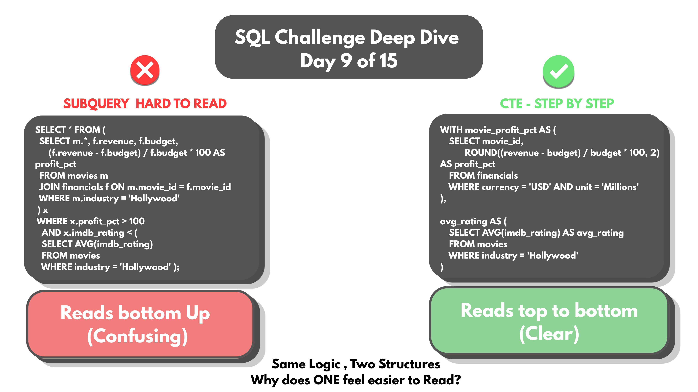
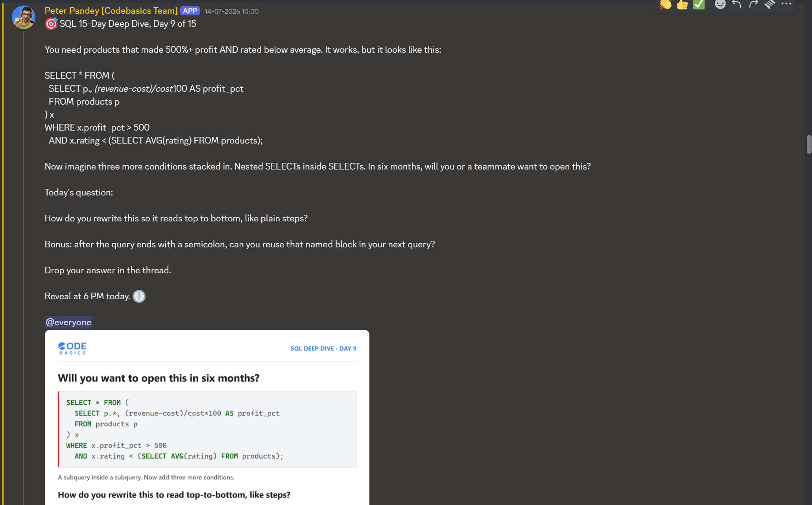

# Day 09 -- CTEs vs Nested Subqueries: Same Execution, Different Readability



## Challenge



The requirement: products (or in this case, movies) that made 500%+
profit AND are rated below average. A working version looks like this:

```sql
SELECT * FROM (
    SELECT p.*, (revenue-cost)/cost*100 AS profit_pct
    FROM products p
) x
WHERE x.profit_pct > 500
  AND x.rating < (SELECT AVG(rating) FROM products);
```

It works. Now imagine three more conditions stacked in, nested SELECTs
inside SELECTs. In six months, will you or a teammate want to open this?

The question: how do you rewrite this so it reads top to bottom, like
plain steps?

Bonus: after a query ends with a semicolon, can a named block from it be
reused in the next query?

## Concept Covered

-- Subqueries and CTEs run the same underneath -- the database doesn't
execute them any differently. The difference is entirely about whether a
human can read the logic without untangling nested layers first.

-- A CTE (`WITH ... AS (...)`) names a block of logic up front, so the
final SELECT reads as a sequence of already-defined steps instead of a
query buried inside another query.

## Example Walkthrough

The actual problem query, rebuilt on a personal Hollywood movies dataset
(`movies` + `financials` tables) instead of the generic products example:

```sql
SELECT * FROM (
    SELECT m.*, f.revenue, f.budget,
           (f.revenue - f.budget) / f.budget * 100 AS profit_pct
    FROM movies m
    JOIN financials f ON m.movie_id = f.movie_id
    WHERE m.industry = 'Hollywood'
) x
WHERE x.profit_pct > 100
  AND x.imdb_rating < (
        SELECT AVG(imdb_rating)
        FROM movies
        WHERE industry = 'Hollywood'
      );
```

Rewritten as two named CTEs, each doing one clear job before the final
SELECT joins them together:

```sql
WITH movie_profit_pct AS (
    SELECT movie_id,
           ROUND((revenue - budget) / budget * 100, 2) AS profit_pct
    FROM financials
    WHERE currency = 'USD' AND unit = 'Millions'
),
avg_rating AS (
    SELECT AVG(imdb_rating) AS avg_rating
    FROM movies
    WHERE industry = 'Hollywood'
)
SELECT m.movie_id, m.title, mpp.profit_pct
FROM movies m
JOIN movie_profit_pct mpp ON mpp.movie_id = m.movie_id
CROSS JOIN avg_rating a
WHERE mpp.profit_pct > 100
  AND m.imdb_rating < a.avg_rating
  AND m.industry = 'Hollywood';
```

`movie_profit_pct` computes profit percentage once, cleanly. `avg_rating`
computes the Hollywood average once, cleanly. The final SELECT just joins
the two named results and applies the filters -- nothing nested inside
anything else.

Full query file: [DAY-09-Queries.sql](DAY-09-Queries.sql)

## Results

Movies with 100%+ profit and a rating below the Hollywood average:

| movie_id | title                                    | profit_pct |
|----------|--------------------------------------------|------------|
| 102      | Doctor Strange in the Multiverse of Madness | 377.40     |
| 103      | Thor: The Dark World                        | 290.79     |
| 105      | Thor: Love and Thunder                      | 168.00     |

Full output: [DAY-09-results.csv](DAY-09-results.csv)

## Applying the Concept

Bonus: after a query ends with a semicolon, can a CTE's named block be
reused in the next query?

This was tested directly rather than assumed -- by trying to query the
CTE names on their own, right after running the main query:

```sql
SELECT * FROM avg_rating;
```
```
Error Code: 1146. Table 'my_movies.avg_rating' doesn't exist
```

```sql
SELECT m.movie_id, m.title, mpp.profit_pct
FROM movies m
JOIN movie_profit_pct mpp ON mpp.movie_id = m.movie_id ...
```
```
Error Code: 1146. Table 'my_movies.movie_profit_pct' doesn't exist
```

**No.** Once the semicolon hits, the CTE is gone -- it only exists for
the duration of the single statement it was defined in. Both errors
confirm this directly rather than just describing the rule: `avg_rating`
and `movie_profit_pct` are treated as if they were never created at all
in a fresh query.

## Key Takeaway

CTEs and nested subqueries produce the same execution plan -- choosing
one over the other is a readability decision, not a performance one.
Naming each logical step with `WITH` turns a query that has to be read
inside-out into one that reads top to bottom, which matters most exactly
when more conditions get stacked on later. And a CTE's scope is strictly
one statement: it can't be treated like a temporary table across
multiple queries, only within the query it's attached to.

## Video Walkthrough

Watch on LinkedIn: [Video-presentation](https://www.linkedin.com/posts/vishnu-ram-sachin-d-_sql-dataanalytics-codebasicschallenge-activity-7482733515910848512-R9u1?utm_source=share&utm_medium=member_desktop&rcm=ACoAAD-YjK4B1ekkuKaP0cSvVwYi6kAAiCTAQhY)

## Files in This Folder

- [DAY-09-Queries.sql](DAY-09-Queries.sql) -- full query file
- [DAY-09-results.csv](DAY-09-results.csv) -- final CTE query output
- DAY-09-Challenge.png -- challenge prompt
- DAY-09-Thumbnail.png -- video thumbnail
