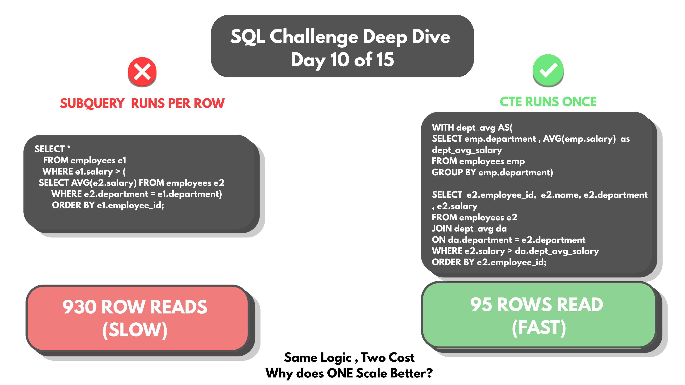
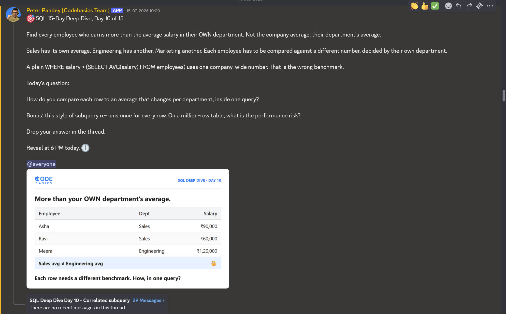

# Day 10 -- Correlated Subquery vs CTE: Correct Isn't Always Efficient



## Challenge



Find employees earning more than their OWN department's average -- not
the company-wide average.

The obvious first query calculates one number for the whole company:

```sql
SELECT * FROM employees
WHERE salary > (SELECT AVG(salary) FROM employees);
```

Correct math, wrong requirement. Sales, Marketing, Engineering, HR,
Analytics, and Finance each deserve their own benchmark, not one number
shared across every department.

## Concept Covered

-- The fix is a correlated subquery -- one where the inner query
references a column from the outer query, so it can't be evaluated
independently:

```sql
SELECT * FROM employees e1
WHERE e1.salary > (
    SELECT AVG(e2.salary) FROM employees e2
    WHERE e2.department = e1.department
)
ORDER BY e1.employee_id;
```

-- One line does the work: `e2.department = e1.department`. The same
`employees` table is referenced twice, under two aliases, and that single
condition makes the inner AVG() recalculate fresh for every outer row's
department instead of once for the whole company.

-- This solves the requirement correctly -- but the "one referenced
twice" part matters for what comes next: a correlated subquery re-runs
once per outer row, not once total.

## Results

Employees earning more than their own department's average:

| employee_id | name          | department | salary |
|-------------|---------------|------------|--------|
| 4           | Meena         | Sales      | 55000  |
| 5           | Ravi          | Sales      | 60000  |
| 6           | Sneha         | Sales      | 65000  |
| 11          | Deepak        | Analytics  | 95000  |
| 12          | Sachin        | Analytics  | 120000 |
| 16          | Lakshmi       | Marketing  | 45000  |
| 17          | Vijay         | Marketing  | 50000  |
| 18          | Nisha         | Marketing  | 55000  |
| 22          | Radha         | HR         | 50000  |
| 23          | Ganesh        | HR         | 54000  |
| 24          | Swathi        | HR         | 58000  |
| 28          | Latha         | Finance    | 78000  |
| 29          | Suresh Kumar  | Finance    | 86000  |
| 30          | Bhavani       | Finance    | 96000  |
| 31          | Meena         | Analytics  | 120000 |

15 employees, spread across all 6 departments -- each one earning above
their own team's average, not the company's.

Full output: [DAY-10-results.csv](DAY-10-results.csv)

Full query file: [DAY-10-Queries.sql](DAY-10-Queries.sql)

## Applying the Concept

Bonus question: this style of subquery re-runs once for every row. On a
million-row table, what's the performance risk?

Tested directly with `EXPLAIN ANALYZE` on both the correlated subquery
and an equivalent CTE-based version, against the same 31-employee table.

**Correlated subquery** -- the inner AVG() re-executes once per outer
row (`loops=31`):

```
-> Filter: (e1.salary > (select #2))  (actual rows=15 loops=1)
    -> Index scan on e1 using PRIMARY  (actual rows=31 loops=1)
    -> Select #2 (subquery in condition; dependent)
        -> Aggregate: avg(e2.salary)  (actual rows=1 loops=31)
            -> Filter: (e2.department = e1.department)  (actual rows=6 loops=31)
                -> Table scan on e2  (actual rows=31 loops=31)
```

That last line is the cost: a full table scan on `e2`, repeated 31 times
-- once per employee in `e1` -- for roughly **930 row reads** total on a
table of just 30-something rows.

**CTE version**, computing each department's average once and joining it
back in:

```sql
WITH dept_avg AS (
    SELECT emp.department, AVG(emp.salary) AS dept_avg_salary
    FROM employees emp
    GROUP BY emp.department
)
SELECT e2.employee_id, e2.name, e2.department, e2.salary
FROM employees e2
JOIN dept_avg da ON da.department = e2.department
WHERE e2.salary > da.dept_avg_salary
ORDER BY e2.employee_id;
```

```
-> Nested loop inner join  (actual rows=15 loops=1)
    -> Filter: (e2.department is not null)  (actual rows=31 loops=1)
        -> Index scan on e2 using PRIMARY  (actual rows=31 loops=1)
    -> Filter: (e2.salary > da.dept_avg_salary)  (actual rows=0 loops=31)
        -> Covering index lookup on da  (actual rows=1 loops=31)
            -> Materialize CTE dept_avg  (actual rows=5 loops=1)
                -> Aggregate using temporary table  (actual rows=5 loops=1)
                    -> Table scan on emp  (actual rows=31 loops=1)
```

Here, `Materialize CTE dept_avg` computes every department's average in
a single pass (`loops=1`) and stores it. The join then does a cheap
index lookup per row instead of recalculating an average each time --
roughly **95 row reads** total.

Full EXPLAIN output:
[DAY-10-Bonus-SUBQUERY-results.csv](DAY-10-Bonus-SUBQUERY-results.csv) |
[DAY-10-Bonus-CTE-results.csv](DAY-10-Bonus-CTE-results.csv)

Both queries return the same 15 correct rows. The correlated subquery
does nearly **10x more work** to get there. On 30 employees that
difference is invisible -- fractions of a millisecond either way. On a
million-row table, the same ratio is the difference between a query that
finishes in milliseconds and one that takes minutes, because the inner
AVG() would be recalculating from scratch for every single one of a
million outer rows.

## Key Takeaway

Correct isn't always efficient. A correlated subquery and a CTE-plus-join
can return byte-for-byte the same result while doing radically different
amounts of work underneath -- the correlated version repeats its inner
calculation once per outer row, while the CTE computes each group's
value exactly once and reuses it. At small scale this gap is invisible;
at scale it's the difference between a query nobody notices and one that
pages someone at 3am. `EXPLAIN ANALYZE` is what turns "probably slower"
into an actual number worth acting on.

## Video Walkthrough

Watch on LinkedIn: [link]

## Files in This Folder

- [DAY-10-Queries.sql](DAY-10-Queries.sql) -- full query file
- [DAY-10-results.csv](DAY-10-results.csv) -- employees above department average
- [DAY-10-Bonus-SUBQUERY-results.csv](DAY-10-Bonus-SUBQUERY-results.csv) -- EXPLAIN ANALYZE, correlated subquery (~930 row reads)
- [DAY-10-Bonus-CTE-results.csv](DAY-10-Bonus-CTE-results.csv) -- EXPLAIN ANALYZE, CTE version (~95 row reads)
- DAY-10-Challenge.png -- challenge prompt
- DAY-10-Thumbnail.png -- video thumbnail
