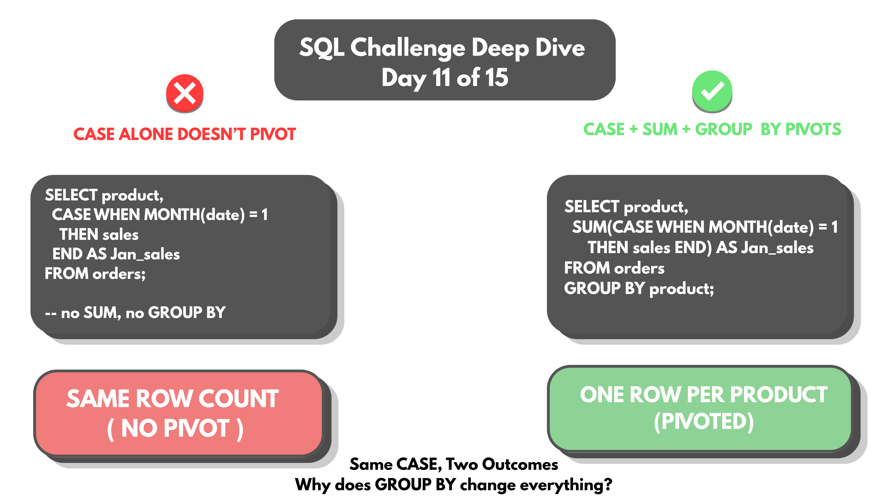
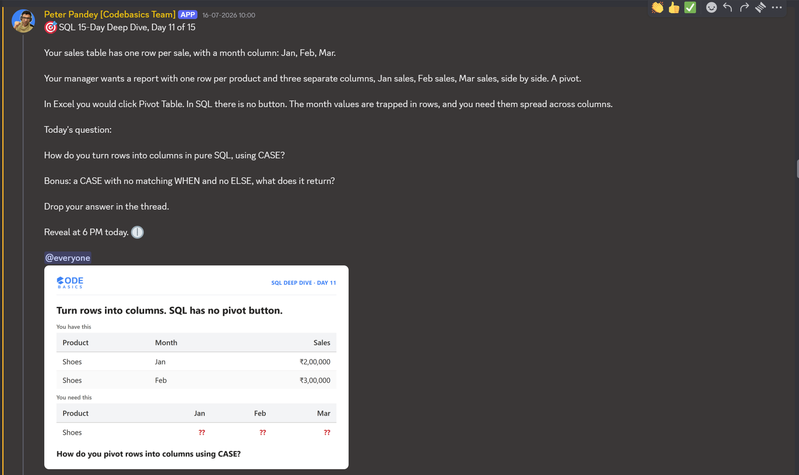

# Day 11 -- Pivoting Rows into Columns with CASE (SQL's Manual Pivot Table)



## Challenge



A manager wants a report with one row per product, and three separate
columns side by side -- Jan sales, Feb sales, Mar sales. A pivot.

How do you turn rows into columns in pure SQL, using CASE?

Practiced first on a personal test database, then moved to AtliQ
Hardware's production sales data (`gdb023`) to test the same logic at
real scale -- 335 products, a full year of monthly sales facts.

## Concept Covered

-- `CASE` syntax is `WHEN condition THEN result ... ELSE fallback END`.
Each `CASE` here checks the month of a row's date and, if it matches,
returns that row's `sold_quantity` -- otherwise it contributes nothing to
that column.

-- `CASE` checks every row independently, routing its value into
whichever month bucket matches. `SUM` then adds up whatever landed in
each bucket, per product. `GROUP BY` is what defines "one product" in
the first place -- it could be `product_code`, `variant`, or `product`
name, depending on how uniqueness is actually defined in a given
database.

-- Testing the pieces separately shows why both SUM and GROUP BY matter,
not just CASE:

**Without SUM** (CASE alone, no aggregation):
```sql
SELECT dp.product_code, dp.product,
    (CASE WHEN MONTH(date)=1 THEN sold_quantity END) AS Jan_sales,
    (CASE WHEN MONTH(date)=2 THEN sold_quantity END) AS Feb_sales,
    (CASE WHEN MONTH(date)=3 THEN sold_quantity END) AS Mar_sales
FROM fact_sales_monthly fs
JOIN dim_product dp ON fs.product_code = dp.product_code
WHERE YEAR(date) = 2021
GROUP BY dp.product_code, dp.variant;
```
Each row only shows the one month it actually belongs to, with the other
two columns NULL -- there's no aggregation collapsing the raw fact rows
into one row per product.

**Without GROUP BY** (SUM present, but nothing to group by):
```sql
SELECT dp.product_code, dp.product,
    SUM(CASE WHEN MONTH(date) = 1 THEN sold_quantity END) AS Jan_sales,
    SUM(CASE WHEN MONTH(date) = 2 THEN sold_quantity END) AS Feb_sales,
    SUM(CASE WHEN MONTH(date) = 3 THEN sold_quantity END) AS Mar_sales
FROM fact_sales_monthly fs
JOIN dim_product dp ON fs.product_code = dp.product_code
WHERE YEAR(date) = 2021;
```
Without a GROUP BY, the whole result collapses into a single row --
every product's sales summed together, losing the one-row-per-product
structure the report actually needs.

## Example Walkthrough

Both pieces together -- CASE to route values into month buckets, SUM to
aggregate within each bucket, GROUP BY to keep one row per product:

```sql
SELECT dp.product_code, dp.product,
    SUM(CASE WHEN MONTH(date)=1 THEN sold_quantity END) AS Jan_sales,
    SUM(CASE WHEN MONTH(date)=2 THEN sold_quantity END) AS Feb_sales,
    SUM(CASE WHEN MONTH(date)=3 THEN sold_quantity END) AS Mar_sales
FROM fact_sales_monthly fs
JOIN dim_product dp ON fs.product_code = dp.product_code
WHERE YEAR(date) = 2021
GROUP BY dp.product_code, dp.product;
```

Full query file: [DAY-11-Queries.sql](DAY-11-Queries.sql)

## Results

Run against AtliQ Hardware's real 2021 sales data, this returns 335
products -- one row each, Jan/Feb/Mar sales laid out side by side. A
sample across the range:

| product_code | product                                      | Jan_sales | Feb_sales | Mar_sales |
|----------------|-----------------------------------------------|-----------|-----------|-----------|
| A0118150101    | AQ Dracula HDD -- 3.5 Inch SATA 6 Gb/s 5400 RPM | 7400      | 7214      | 6199      |
| A2118150101    | AQ Master wired x1 Ms                          | 28352     | 28468     | 31413     |
| A6218160101    | AQ Digit SSD                                    | 29970     | 30451     | 30143     |
| A6720160103    | AQ Pen Drive 2 IN 1                             | 53519     | 48631     | 51296     |
| A6018110101    | AQ Home Allin1                                  | 167       | 145       | 163       |
| A5318110103    | AQ Gamer 1                                      | 502       | 515       | 500       |

The scale swing is the interesting part -- from 167 units for the AQ Home
Allin1 up to 53,519 units for the AQ Pen Drive 2-in-1, all pivoted
through the exact same CASE + SUM + GROUP BY pattern with no special
handling per product.

Full output, all 335 products: [DAY-11-results.csv](DAY-11-results.csv)

## Applying the Concept

Bonus: what does a `CASE` with no matching `WHEN` and no `ELSE` actually
return?

**NULL.** SQL implicitly adds `ELSE NULL` to any CASE expression that
doesn't write one explicitly. So for a row where `MONTH(date)` is, say,
5, none of the `WHEN MONTH(date)=1`, `=2`, or `=3` branches match in any
of the three CASE expressions -- each one silently falls through to the
implicit `ELSE NULL`, and that row contributes nothing to any of the
three month columns for that pass. This is exactly why SUM works safely
here: SUM ignores NULLs rather than treating them as zero or erroring
out, so a row that doesn't belong to Jan, Feb, or Mar just doesn't affect
any of those three totals.

## Key Takeaway

CASE inside SUM is SQL's manual version of a pivot table -- there's no
special PIVOT syntax needed, just a conditional expression doing the
routing and an aggregate doing the collapsing. The pattern held up
identically moving from a small personal test database to 335 real
products and a full year of production sales data -- same query, same
logic, just more rows underneath it.

## Video Walkthrough

Watch on LinkedIn: [link]

## Files in This Folder

- [DAY-11-Queries.sql](DAY-11-Queries.sql) -- full query file
- [DAY-11-results.csv](DAY-11-results.csv) -- pivoted Jan/Feb/Mar sales, all 335 products
- DAY-11-Challenge.png -- challenge prompt
- DAY-11-Thumbnail.png -- video thumbnail
