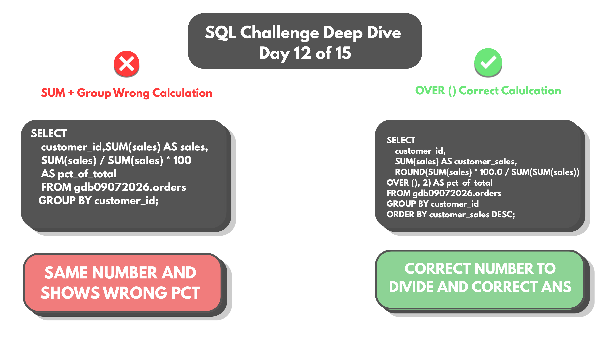
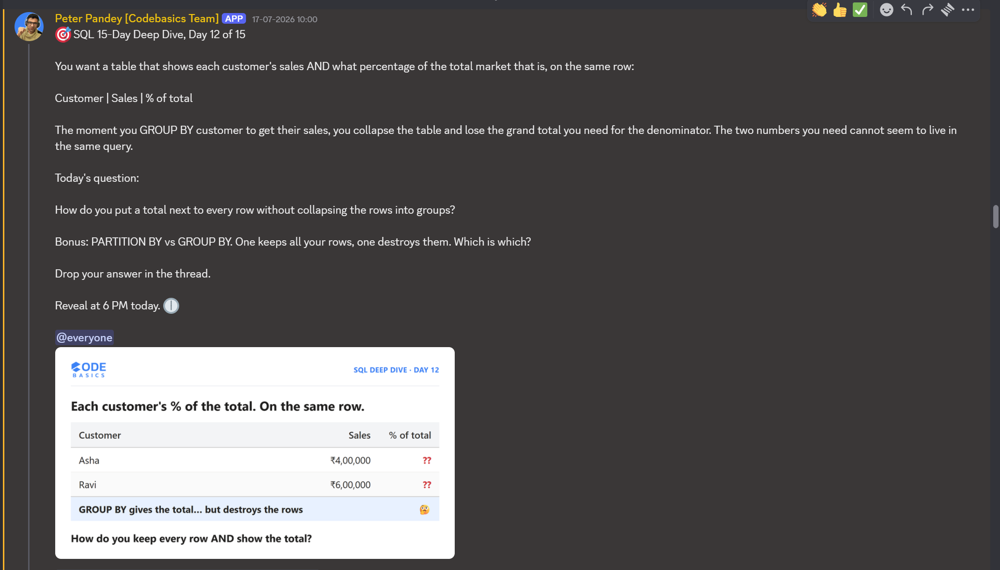

# Day 12 -- Row-Level Totals Without Collapsing Rows (Window Functions)



## Challenge



A table is needed showing each customer's sales AND what percentage of
the total market that represents, on the same row:

`Customer | Sales | % of total`

How do you put a grand total next to every row without collapsing the
rows into groups?

```sql
SELECT
    customer_id, SUM(sales) AS sales,
    SUM(sales) / SUM(sales) * 100 AS pct_of_total
FROM orders
GROUP BY customer_id;
```

This shows every single customer contributing 100% -- technically
correct math, completely wrong business information. Each customer's
share is only ever being compared to their own total, not the company's.

## Concept Covered

-- `GROUP BY` collapses rows into one row per group, and within that
row, an aggregate like `SUM(sales)` only has access to that group's own
values. It has no way to see the grand total across every other group at
the same time -- that's why `SUM(sales) / SUM(sales)` always equals 1
(100%): both sides of the division are scoped to the same single
customer.

-- The actual requirement -- out of the grand total across every
customer, how much did each one individually contribute -- needs a
number that exists outside any single group. That's what a window
function provides.

## Example Walkthrough

```sql
SELECT
    customer_id,
    SUM(sales) AS customer_sales,
    ROUND(SUM(sales) * 100.0 / SUM(SUM(sales)) OVER (), 2) AS pct_of_total
FROM orders
GROUP BY customer_id
ORDER BY customer_sales DESC;
```

`SUM(SUM(sales)) OVER ()` is doing two layers of work: the inner
`SUM(sales)` still aggregates per customer as GROUP BY requires, but the
outer `SUM(...) OVER ()` -- with an empty, unpartitioned window -- adds
all of those per-customer sums back together into one grand total, and
makes that grand total available on every row simultaneously. Dividing
each customer's own sales by that shared grand total gives a real
percentage of the whole market, not of themselves.

Full query file: [DAY-12-Queries.sql](DAY-12-Queries.sql)

## Results

Each customer's sales alongside their real share of total market sales:

| customer_id | customer_sales | pct_of_total |
|-------------|-----------------|--------------|
| 10          | 181550          | 14.24        |
| 7           | 162710          | 12.77        |
| 2           | 155800          | 12.22        |
| 12          | 152380          | 11.96        |
| 5           | 111150          | 8.72         |
| 8           | 109140          | 8.56         |
| 9           | 109140          | 8.56         |
| 1           | 107830          | 8.46         |
| 4           | 78800           | 6.18         |
| 6           | 68565           | 5.38         |
| 3           | 23230           | 1.82         |
| 11          | 14190           | 1.11         |

Full output: [DAY-12-results.csv](DAY-12-results.csv)

The 12 individual sales figures sum to 1,274,485 -- the exact same grand
total that showed up in Day 04's ROLLUP totals and Day 05's dataset.
Same underlying data, now sliced by customer instead of city, and this
time with each row carrying an honest percentage of that shared total
instead of a meaningless 100%.

## Applying the Concept

Bonus: PARTITION BY vs GROUP BY. One keeps all the rows, one destroys
them. Which is which?

**GROUP BY destroys rows.** It collapses every row in a group down into
a single output row -- detail is permanently gone once GROUP BY runs;
there's no way to see the original per-row data afterward in the same
result set.

**PARTITION BY keeps all the rows.** It's a window function clause, not
an aggregation clause -- it defines a window (a group of related rows)
for a calculation to look across, but every original row still survives
in the output, now carrying that window's calculated value alongside its
own detail. `OVER ()` with no PARTITION BY, as used above, is the
simplest case: one single window containing every row in the whole
result set.

## Key Takeaway

GROUP BY and window functions solve genuinely different problems that
happen to look similar. GROUP BY answers "what's the total per group,"
losing row-level detail to get there. A window function answers "what's
this row's value, plus some total or ranking calculated across a wider
set of rows," without losing anything -- every row survives, just
enriched with context from beyond itself. The percentage-of-total pattern
here is one of the most common reasons to reach for a window function
instead of a plain aggregate.

## Video Walkthrough

Watch on LinkedIn: [Voice-over-presentation](https://www.linkedin.com/posts/vishnu-ram-sachin-d-_sql-dataanalytics-codebasics-activity-7483927387168993280-3pRq?utm_source=share&utm_medium=member_desktop&rcm=ACoAAD-YjK4B1ekkuKaP0cSvVwYi6kAAiCTAQhY)

## Files in This Folder

- [DAY-12-Queries.sql](DAY-12-Queries.sql) -- full query file
- [DAY-12-results.csv](DAY-12-results.csv) -- customer sales with % of total
- DAY-12-Challenge.png -- challenge prompt
- DAY-12-Thumbnail.png -- video thumbnail
