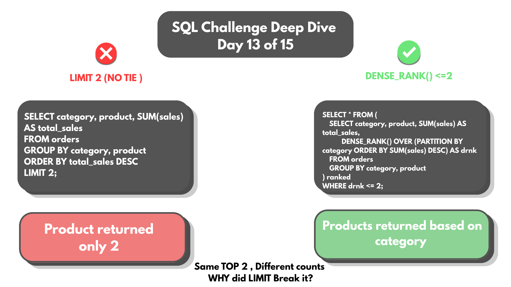
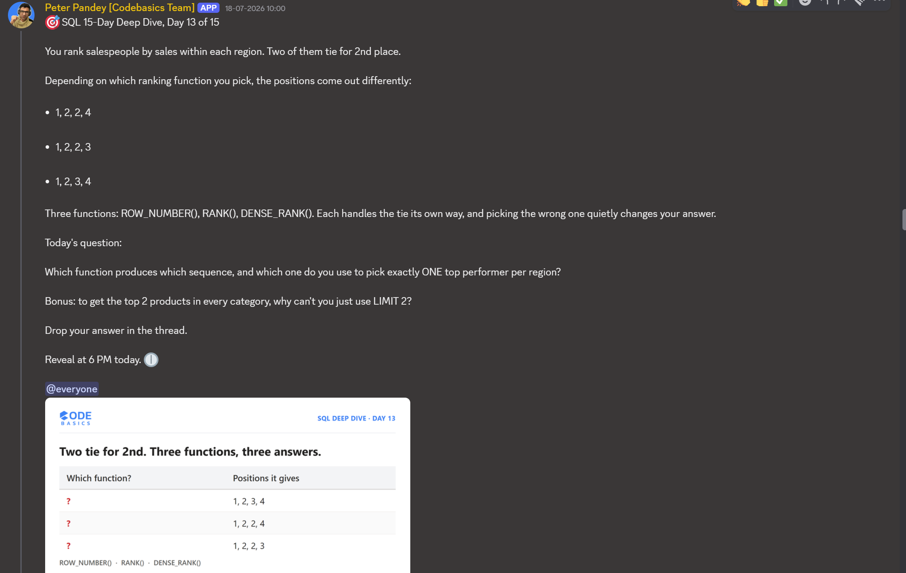

# Day 13 -- ROW_NUMBER vs RANK vs DENSE_RANK: Same Tie, Three Different Answers



## Challenge



Salespeople are ranked by sales within each region. Two of them tie for
2nd place. Three different ranking functions exist for this -- and they
don't agree on what "2nd place" even means once a tie shows up.

Pick the wrong one and a "top performer per region" query either drops
someone who genuinely deserved to be there, or keeps a duplicate that
wasn't wanted.

## Concept Covered

-- **ROW_NUMBER()** gives every row a unique number, even tied ones --
ties get split arbitrarily, with no way to predict which tied row gets
which number without an explicit tiebreaker column.

-- **RANK()** gives tied rows the same number, then skips ahead by the
count of ties: 1, 2, 2, 4 -- the next distinct value jumps past the
number a tie "used up."

-- **DENSE_RANK()** gives tied rows the same number too, but never skips:
1, 2, 2, 3 -- the next distinct value always follows immediately.

Run side by side against the same student_marks table used back in Day
03, all three ranking columns make the difference concrete on real ties
(72 marks tied at position 5-6, 60 marks tied three ways, 14 marks tied
two ways):

```sql
SELECT s.student_id, s.name, s.marks,
       ROW_NUMBER() OVER (ORDER BY s.marks DESC) AS rn,
       RANK()       OVER (ORDER BY s.marks DESC) AS rnk,
       DENSE_RANK() OVER (ORDER BY s.marks DESC) AS drnk
FROM student_marks s;
```

| name     | marks | rn | rnk | drnk |
|----------|-------|----|----|------|
| ishika   | 98    | 1  | 1  | 1    |
| Ravi     | 95    | 2  | 2  | 2    |
| Raju     | 90    | 3  | 3  | 3    |
| ramesh   | 85    | 4  | 4  | 4    |
| Prashant | 72    | 5  | 5  | 5    |
| Mahesh   | 72    | 6  | 5  | 5    |
| Kiran    | 60    | 7  | 7  | 6    |
| gayatri  | 60    | 8  | 7  | 6    |
| Vipul    | 60    | 9  | 7  | 6    |
| Arjun    | 33    | 10 | 10 | 7    |
| parth    | 28    | 11 | 11 | 8    |
| suresh   | 14    | 12 | 12 | 9    |
| aditya   | 14    | 13 | 12 | 9    |
| Akhil    | 7     | 14 | 14 | 10   |

Full output: [DAY-13-Explanation-concepts-results.csv](DAY-13-Explaination-concepts-results.csv)

Watch what happens at the three-way tie on 60 marks: `rn` keeps counting
7, 8, 9 as if nothing happened. `rnk` gives all three the same 7, then
jumps straight to 10 for Arjun -- positions 8 and 9 are burned and never
appear again. `drnk` also gives all three the same 6, but the very next
distinct value is 7 -- nothing gets burned.

## Example Walkthrough

If exactly ONE top performer per region is needed, use `ROW_NUMBER()`.
It forces a single winner even when there's a tie, because a real-world
"top performer" question needs an actual tiebreaker, not two answers.

```sql
SELECT * FROM (
    SELECT c.region, c.customer, SUM(o.sales) AS total_sales,
           ROW_NUMBER() OVER (PARTITION BY c.region ORDER BY SUM(o.sales) DESC) AS rn
    FROM orders o
    JOIN customers c ON o.customer_id = c.customer_id
    GROUP BY c.region, c.customer
) ranked
WHERE rn = 1;
```

`PARTITION BY c.region` resets the ranking separately for each region,
so "rank 1" means top-of-region, not top-overall.

Full query file: [DAY-13-Queries.sql](DAY-13-Queries.sql)

## Results

Top customer by total sales, one per region:

| region | customer         | total_sales |
|--------|-------------------|-------------|
| East   | Sourav Ghosh      | 162710      |
| North  | Vikram Malhotra   | 181550      |
| South  | Divya Rao         | 155800      |
| West   | Rohan Deshmukh    | 111150      |

Full output: [DAY-13-results.csv](DAY-13-results.csv)

Exactly one winner per region, guaranteed by ROW_NUMBER() -- even if any
of these regions had a tie for the top spot underneath, this query would
still return exactly 4 rows, one per region.

## Applying the Concept

Bonus: pulling the top 2 products per category, and there's a tie for
2nd place. LIMIT 2 is the instinctive choice -- and the wrong one.

```sql
SELECT category, product, SUM(sales) AS total_sales
FROM orders
GROUP BY category, product
ORDER BY total_sales DESC
LIMIT 2;
```

LIMIT just counts rows -- it doesn't know or care about ties, and it
doesn't even respect categories here, since there's no PARTITION BY
equivalent for a plain LIMIT. A product tied for 2nd place gets silently
cut with no warning.

The fix: `DENSE_RANK() <= 2`, partitioned per category, respects ties
instead of arbitrarily cutting through them:

```sql
SELECT * FROM (
    SELECT category, product, SUM(sales) AS total_sales,
           DENSE_RANK() OVER (PARTITION BY category ORDER BY SUM(sales) DESC) AS drnk
    FROM orders
    GROUP BY category, product
) ranked
WHERE drnk <= 2;
```

Confirmed output -- top 2 products per category, by DENSE_RANK:

| category    | product   | total_sales | drnk |
|-------------|-----------|-------------|------|
| Clothing    | Jacket    | 39950       | 1    |
| Clothing    | Shoes     | 32250       | 2    |
| Electronics | Laptop    | 647500      | 1    |
| Electronics | Phone     | 395500      | 2    |
| Groceries   | Rice Bag  | 59770       | 1    |
| Groceries   | Oil Can   | 11180       | 2    |

Full output: [DAY-13-Bonus-results.csv](DAY-13-Bonus-results.csv)

Six rows -- exactly 2 per category, correctly partitioned. If any
category had had a genuine tie for 2nd place, DENSE_RANK would have kept
both tied products rather than arbitrarily dropping one, the same
protection proven back in Day 03.

## Key Takeaway

Same data, three functions, three different results -- and the "right"
one depends entirely on what the question actually needs. ROW_NUMBER()
forces a single answer even through a tie, which is exactly right when
the business genuinely needs one winner. RANK() and DENSE_RANK() both
preserve ties, but only DENSE_RANK() keeps the numbering contiguous
afterward -- which matters the moment that ranking is filtered with a
`<=` condition, since RANK()'s skipped numbers can quietly exclude rows
a naive `<= N` filter meant to include.

## Video Walkthrough

Watch on LinkedIn: [Voice-over-presentation](https://www.linkedin.com/posts/vishnu-ram-sachin-d-_sql-dataanalytics-codebasics-activity-7484313227053518849-WLZV?utm_source=share&utm_medium=member_desktop&rcm=ACoAAD-YjK4B1ekkuKaP0cSvVwYi6kAAiCTAQhY)

## Files in This Folder

- [DAY-13-Queries.sql](DAY-13-Queries.sql) -- full query file
- [DAY-13-Explaination-concepts-results.csv](DAY-13-Explaination-concepts-results.csv) -- ROW_NUMBER/RANK/DENSE_RANK comparison on student_marks
- [DAY-13-results.csv](DAY-13-results.csv) -- top customer per region (ROW_NUMBER)
- [DAY-13-Bonus-results.csv](DAY-13-Bonus-results.csv) -- top 2 products per category (DENSE_RANK)
- DAY-13-Challenge.png -- challenge prompt
- DAY-13-Thumbnail.png -- video thumbnail
