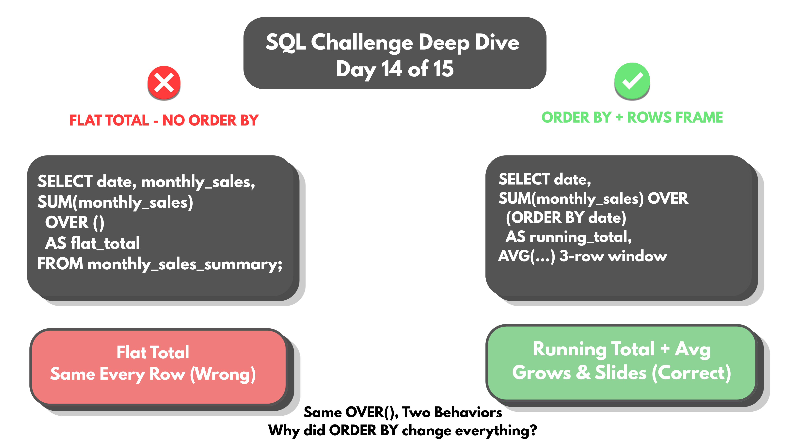
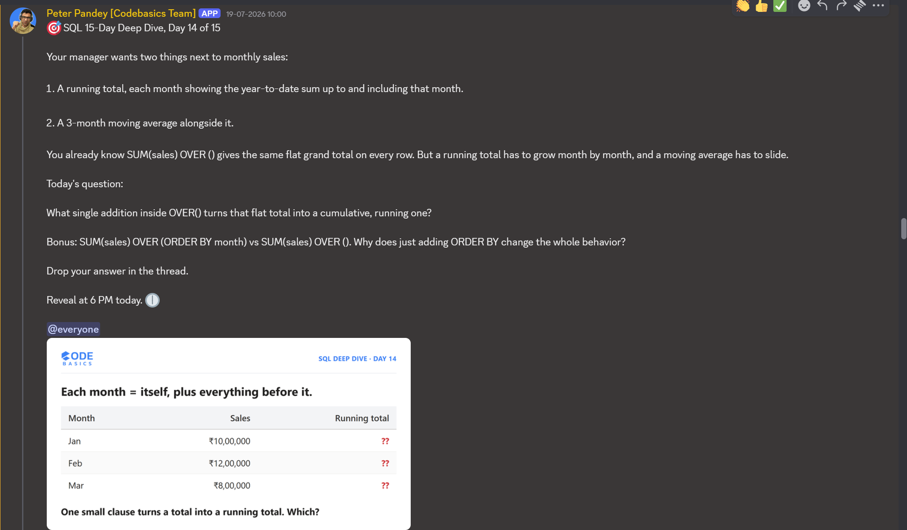

# Day 14 -- Running Total vs Moving Average: Why ORDER BY Changes Everything Inside OVER()



## Challenge



Same `SUM(sales)`, same `OVER()`. So why does one query give a flat total
repeated on every row, and the other grow row by row instead?

```sql
SELECT
    date,
    ROUND(monthly_sales / 1000000, 2) AS monthly_sales_M,
    ROUND(SUM(monthly_sales) OVER () / 1000000, 2) AS flat_total_M
FROM monthly_sales_summary
ORDER BY date;
```

## Concept Covered

The answer is one word: **ORDER BY**. Add it inside `OVER()` and a flat
total turns into a running total.

-- Without an ORDER BY inside `OVER()`, there's no "current row" for SQL
to anchor to -- so it just sums the entire result set, on every single
row. That's why `flat_total_M` shows the exact same number all the way
down.

-- Add `ORDER BY date` inside `OVER()`, and every row suddenly has a real
position in the sequence. SQL's default window shifts to "everything from
the start up to here" -- so each row's total is the sum of every month up
to and including that one. It only grows, never forgets.

-- A moving average works differently again. Instead of growing forever,
it uses a *fixed* window: the current row plus the 2 rows before it, via
`ROWS BETWEEN 2 PRECEDING AND CURRENT ROW`. As a new month enters the
window, the oldest one gets dropped. It slides instead of accumulating --
which is exactly why it smooths out one noisy month instead of getting
permanently thrown off by it, the way a running total would.

One keyword inside `OVER()` -- ORDER BY -- is the entire difference
between a number that never changes and one that meaningfully tracks
progress over time.

## Example Walkthrough

Built on AtliQ Hardware's `fact_sales_monthly` and `fact_gross_price`
tables (`gdb023`), joined and aggregated into a monthly sales summary
first:

```sql
WITH monthly_sales_summary AS (
    SELECT
        s.date,
        SUM(s.sold_quantity * g.gross_price) AS monthly_sales
    FROM fact_sales_monthly s
    JOIN fact_gross_price g
        ON s.product_code = g.product_code
        AND s.fiscal_year = g.fiscal_year
    GROUP BY s.date
)
SELECT
    date,
    ROUND(monthly_sales / 1000000, 2) AS monthly_sales_M,
    ROUND(SUM(monthly_sales) OVER (ORDER BY date) / 1000000, 2) AS running_total_M,
    ROUND(AVG(monthly_sales) OVER (
        ORDER BY date
        ROWS BETWEEN 2 PRECEDING AND CURRENT ROW
    ) / 1000000, 2) AS moving_avg_3m_M
FROM monthly_sales_summary
ORDER BY date;
```

Full query file (both the flat-total version and this fix): [DAY-14-Queries.sql](DAY-14-Queries.sql)

## Results

Every month from September 2019 through August 2021, with all three
totals side by side:

| date       | monthly_sales_M | running_total_M | moving_avg_3m_M |
|------------|------------------|-------------------|--------------------|
| 2019-09-01 | 45.15            | 45.15             | 45.15              |
| 2019-10-01 | 56.73            | 101.87            | 50.94              |
| 2019-11-01 | 78.67            | 180.54            | 60.18              |
| 2019-12-01 | 83.49            | 264.04            | 72.96              |
| 2020-01-01 | 45.42            | 309.45            | 69.19              |
| 2020-02-01 | 43.97            | 353.42            | 57.63              |
| 2020-03-01 | 5.58             | 359.00            | 31.65              |
| 2020-04-01 | 20.61            | 379.61            | 23.39              |
| 2020-05-01 | 26.24            | 405.85            | 17.47              |
| 2020-06-01 | 40.09            | 445.94            | 28.98              |
| 2020-07-01 | 44.10            | 490.04            | 36.81              |
| 2020-08-01 | 45.91            | 535.95            | 43.37              |
| 2020-09-01 | 121.24           | 657.19            | 70.42              |
| 2020-10-01 | 153.02           | 810.21            | 106.73             |
| 2020-11-01 | 207.22           | 1017.43           | 160.50             |
| 2020-12-01 | 219.62           | 1237.06           | 193.29             |
| 2021-01-01 | 120.95           | 1358.01           | 182.60             |
| 2021-02-01 | 117.17           | 1475.18           | 152.58             |
| 2021-03-01 | 122.18           | 1597.35           | 120.10             |
| 2021-04-01 | 122.38           | 1719.73           | 120.58             |
| 2021-05-01 | 120.34           | 1840.07           | 121.63             |
| 2021-06-01 | 116.56           | 1956.63           | 119.76             |
| 2021-07-01 | 122.49           | 2079.11           | 119.79             |
| 2021-08-01 | 121.47           | 2200.59           | 120.17             |

Full output: [DAY-14-results.csv](DAY-14-results.csv)

March 2020 is the clearest proof of what a moving average is actually
for: monthly sales crash to just 5.58M that month. The running total
barely notices (it just grows a little slower), but the moving average
drops to 31.65M, well below the months around it, then recovers over the
next two months as March rolls out of the 3-month window. That single
unusual month gets absorbed and smoothed, rather than permanently
distorting every total that follows it the way it would in a running
total.

## Applying the Concept

Bonus: why does adding ORDER BY change everything about how `OVER()`
behaves?

Without ORDER BY, there's no concept of "current row" for the window to
anchor to -- every row is equally "in" the window, so SQL's only option
is to sum the whole result set, identically, for every row. That's the
flat total.

The moment ORDER BY is added, every row gets an actual position in a
sequence. SQL's default frame changes accordingly, from "the whole set"
to "everything from the start of the ordering up to this row." Same
`SUM()`, same `OVER()` syntax on the surface, but the presence of that
one keyword completely redefines what the window even contains.

## Key Takeaway

Small things like this are what actually build SQL intuition, not just
memorizing syntax. `OVER()` and `OVER(ORDER BY ...)` look like a minor
variation, but they define entirely different windows underneath: no
anchor versus a real position in a sequence. Adding a frame clause like
`ROWS BETWEEN 2 PRECEDING AND CURRENT ROW` narrows that window further
still, from "everything so far" to "just the last few" -- turning an
ever-growing running total into a moving average that can actually
absorb a single noisy month instead of being permanently skewed by it.

## Video Walkthrough

Watch on LinkedIn: [link]

## Files in This Folder

- [DAY-14-Queries.sql](DAY-14-Queries.sql) -- full query file (flat total + fix)
- [DAY-14-results.csv](DAY-14-results.csv) -- running total and 3-month moving average, all 24 months
- DAY-14-Challenge.png -- challenge prompt
- DAY-14-Thumbnail.png -- video thumbnail
