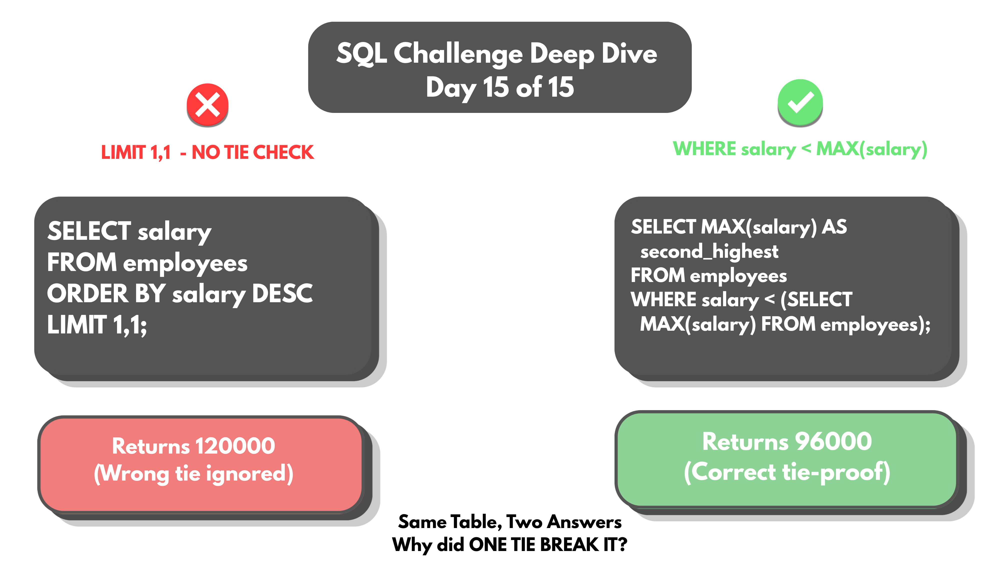
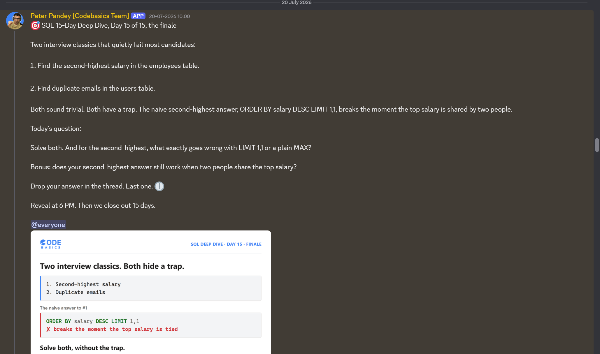

# Day 15 -- Second-Highest Salary and Duplicate Emails (Two Classic Interview Questions)



## Challenge



The finale: two questions that show up constantly in SQL interviews,
that sound trivial, and that quietly trip up most candidates anyway.

**Requirement 1** -- find the second-highest salary in the employees
table.

**Requirement 2** -- find duplicate emails in the users table.

## Requirement 1: Second-Highest Salary

```sql
SELECT salary FROM employees
ORDER BY salary DESC
LIMIT 1,1;
```

This looks right, and often is -- until two people are tied for the top
salary. LIMIT counts rows, not distinct values, so `LIMIT 1,1` just skips
the first row and returns the second one. If two employees share the
highest salary, that second row is still the same tied top value, not
the actual second-highest distinct salary.

**The fix** filters by value instead of by row position:

```sql
SELECT MAX(salary) AS second_highest_salary
FROM employees
WHERE salary < (SELECT MAX(salary) FROM employees);
```

The inner subquery finds the true maximum. The outer query then asks for
the highest salary strictly below that maximum -- a condition that stays
correct no matter how many employees share the top spot, because it's
comparing values, not counting rows.

### Results

| second_highest_salary |
|-------------------------|
| 96000                   |

Full output: [DAY-15-Requiremen-01-results.csv](DAY-15-Requiremen-01-results.csv)

The raw data actually has a genuine tie at the top -- two employees both
at 120000 salary. The fix query handles this correctly without any extra
logic: it isn't confused by the tie, because it was never trying to skip
a row position in the first place. It correctly returns 96000, the true
next-highest distinct value.

Full raw data: [DAY-15-Requiremen-01-Raw-Data.csv](DAY-15-Requiremen-01-Raw-Data.csv)

Full query file: [DAY-15-Queries.sql](DAY-15-Queries.sql)

## Requirement 2: Duplicate Emails

The instinct is to filter with WHERE:

```sql
SELECT email, COUNT(*)
FROM users
WHERE COUNT(*) > 1
GROUP BY email;
```

```
Error Code: 1111. Invalid use of group function
```

WHERE runs before grouping happens, so `COUNT(*)` doesn't exist yet at
that point -- there's nothing to count, because the groups it would count
haven't been formed.

A second attempt tries wrapping the count in a subquery instead:

```sql
SELECT email, COUNT(*)
FROM users
WHERE (SELECT COUNT(*) > 1 FROM users)
GROUP BY email;
```

This one runs without an error, but it's still wrong -- and silently so.
The subquery `(SELECT COUNT(*) FROM users)` just counts every row in the
whole table (6 rows total), checks `6 > 1`, gets TRUE, and applies that
same constant TRUE to every single row before grouping even starts. It's
not asking "does this email repeat," it's asking "does the table have
more than one row at all" -- a question with the same answer for every
email, duplicate or not.

**The fix**:

```sql
SELECT email, COUNT(*) AS occurrences
FROM users
GROUP BY email
HAVING COUNT(*) > 1;
```

GROUP BY forms the per-email groups first. Only after that does
`COUNT(*)` exist as a real, per-group value -- and HAVING filters those
groups afterward, once the counts are actually there to filter on.

### Results

| email             | occurrences |
|--------------------|-------------|
| aarav@mail.com      | 2           |
| priya@mail.com      | 2           |

Full output: [DAY-15-Requiremen-02-results.csv](DAY-15-Requiremen-02-results.csv)

Out of 6 total rows in the raw users table, exactly 2 emails repeat --
aarav@mail.com and priya@mail.com, each appearing twice. karthik@mail.com
and divya@mail.com appear once each and correctly don't show up in the
result.

Full raw data: [DAY-15-Requiremen-02-Raw-Data.csv](DAY-15-Requiremen-02-Raw-Data.csv)

## Key Takeaway

Both problems here share the same root lesson as several earlier days in
this series: SQL clauses run in a specific logical order, and a query can
be syntactically fine, or even run without any error at all, while still
answering a completely different question than the one being asked.
LIMIT counts row position, not tied values. WHERE runs before
aggregation exists. GROUP BY and HAVING exist specifically to let a
condition be applied *after* the groups and their counts are real.
Knowing which clause runs when is what separates a query that happens to
work on today's data from one that's actually correct.

## Series Reflection

Fifteen days, fifteen concepts -- ties silently breaking LIMIT, WHERE
turning LEFT JOIN into INNER JOIN, NULL poisoning NOT IN, correlated
subqueries doing 10x the necessary work, and now, on the last day, two
interview classics that circle back to the same execution-order lessons
from earlier in the series. Started this not knowing if it would get
finished. It did.

## Video Walkthrough

Watch on LinkedIn: [link]

## Files in This Folder

- [DAY-15-Queries.sql](DAY-15-Queries.sql) -- full query file
- [DAY-15-Requiremen-01-results.csv](DAY-15-Requiremen-01-results.csv) -- second-highest salary output
- [DAY-15-Requiremen-01-Raw-Data.csv](DAY-15-Requiremen-01-Raw-Data.csv) -- employees raw data
- [DAY-15-Requiremen-02-results.csv](DAY-15-Requiremen-02-results.csv) -- duplicate emails output
- [DAY-15-Requiremen-02-Raw-Data.csv](DAY-15-Requiremen-02-Raw-Data.csv) -- users raw data
- DAY-15-Challenge.png -- challenge prompt
- DAY-15-Thumbnail.png -- video thumbnail
